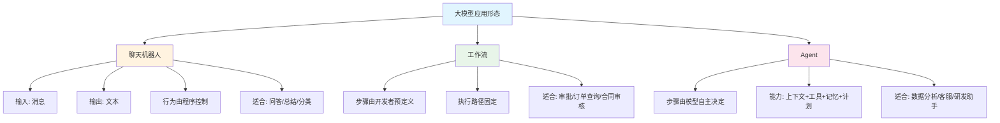
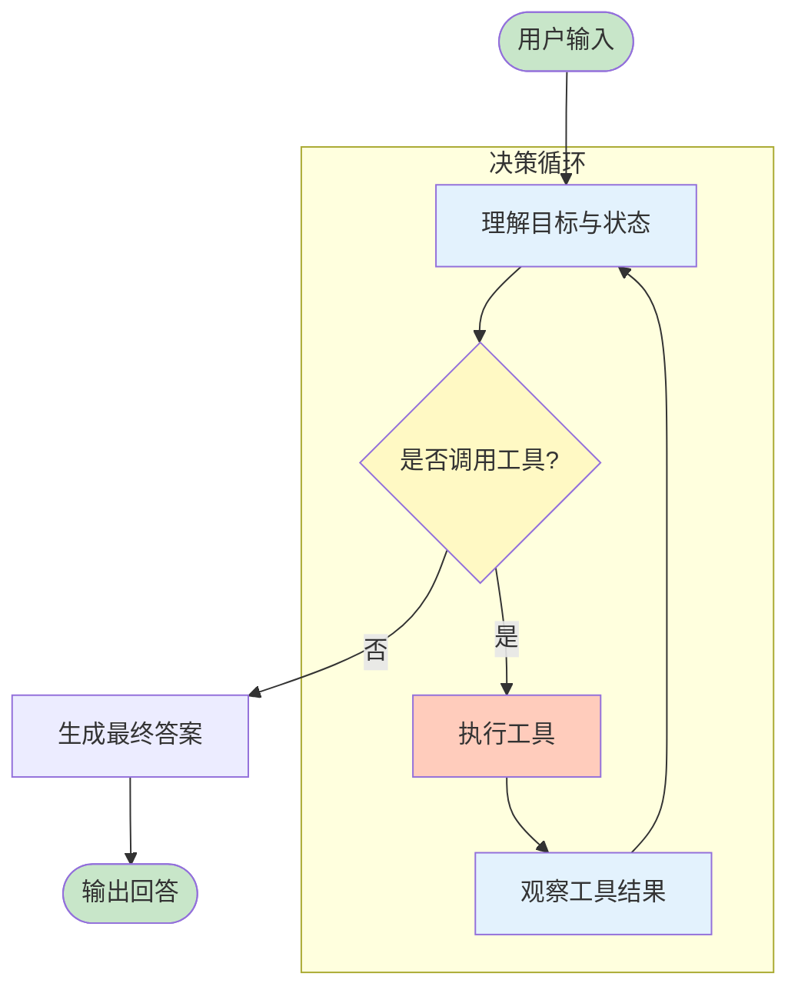
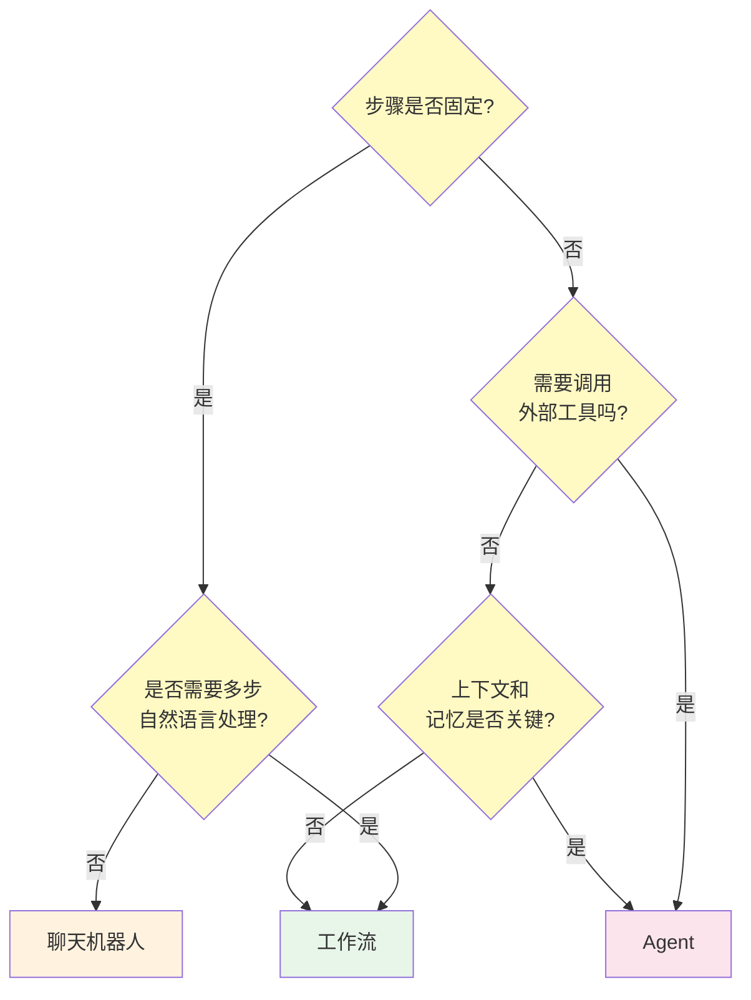

# 01 什么是 Agent

## 本章目标

学 Agent 开发，第一件事不是写代码，而是分清三个东西：聊天机器人、工作流和 Agent。它们都可以调用大模型，但系统形态完全不同。

读完本章，你应该能回答：

- Agent 和普通聊天机器人有什么区别？
- 为什么工具调用、记忆和计划会让系统复杂很多？
- 一个 Agent 系统最小需要哪些模块？
- 什么任务适合 Agent，什么任务不适合？

## 从聊天机器人开始



最简单的大模型应用是聊天机器人：

```ts
const answer = await model.chat([
  { role: 'system', content: '你是一个客服助手' },
  { role: 'user', content: '我的订单什么时候发货？' }
]);
```

它的特点是：

- 输入是消息。
- 输出通常是文本。
- 模型不会真正改变外部系统。
- 如果需要业务数据，通常由程序提前查好，再塞进 prompt。

这种系统适合问答、总结、改写、分类、解释。但它不是 Agent，因为它没有独立选择行动的能力。

## 工作流是什么

工作流是预先设计好的步骤。比如：

```txt
用户问题 -> 意图分类 -> 查询订单 -> 生成回复
```

工作流的特点是：

- 步骤由开发者或产品设计者提前定义。
- 每个节点做什么相对固定。
- 稳定、可控、容易测试。
- 灵活性有限。

工作流很适合企业场景。比如报销审批、订单查询、合同审核、知识库问答，这些任务需要稳定流程，而不是每次都让模型自由决定。

## Agent 是什么

Agent 可以理解成“带有目标、上下文和行动能力的模型运行时”。它不只是回答，而是会在一定边界内决定下一步做什么。

一个典型 Agent 循环是：



这就是 Agent 的核心：**模型不只生成文本，还参与选择行动。**

## Agent 的四个基本能力

### 1. 上下文

Agent 需要知道当前任务发生在什么环境中：

- 用户刚说了什么。
- 历史对话是什么。
- 当前有哪些文件。
- 已经调用过哪些工具。
- 工具返回了什么。
- 当前计划进行到哪一步。

没有上下文，Agent 每次都像失忆一样工作。

### 2. 记忆

上下文通常只属于当前会话；记忆则可以跨会话保留。

记忆可以分几类：

- 用户偏好：用户喜欢简洁回答。
- 长期事实：用户所在公司、常用系统、角色权限。
- 任务状态：一个尚未完成的计划。
- 经验总结：某类问题以前怎么解决过。

记忆不是越多越好。错误记忆会污染后续决策，所以记忆系统必须可更新、可删除、可解释。

### 3. 工具

工具让 Agent 能访问外部世界：

- 查询数据库。
- 调用 HTTP API。
- 搜索知识库。
- 读写文件。
- 执行代码。
- 发送邮件。
- 创建工单。

工具调用让 Agent 从“会说”变成“会做”。同时也带来安全问题：谁允许它调用？参数是否可信？失败如何恢复？调用成本谁承担？

### 4. 计划

复杂任务不能只靠一步回答。Agent 需要把目标拆成步骤：

```txt
目标：帮我分析这份销售数据并生成周报。

计划：
1. 读取文件结构。
2. 识别关键指标。
3. 计算同比和环比。
4. 找异常点。
5. 生成周报草稿。
6. 等用户确认后导出。
```

计划的价值是让系统可控。没有计划，Agent 很容易在工具调用中迷路。

## 三种形态的详细对比

| 维度 | 聊天机器人 | 工作流 | Agent |
|------|-----------|--------|-------|
| **决策者** | 程序 | 开发者 | 模型 |
| **执行路径** | 单步 | 固定 | 动态 |
| **工具调用** | 无，由程序提前查好 | 固定节点 | 模型自主决定 |
| **上下文** | 单轮/有限历史 | 节点间变量传递 | 完整消息时间线 |
| **记忆** | 无 | 无 | 短期+长期 |
| **可控性** | ★★★★★ | ★★★★★ | ★★★ |
| **灵活性** | ★ | ★★★ | ★★★★★ |
| **开发成本** | 低 | 中 | 高 |
| **测试难度** | 低 | 中 | 高 |
| **典型延迟** | < 2s | 2-10s | 5-60s+ |
| **错误处理** | 程序处理 | 节点重试 | 模型+程序混合 |
| **适合团队** | 所有团队 | 后端团队 | AI 专项团队 |

这不是说 Agent 更好。三种形态解决不同问题。一个成熟的产品通常会混合使用三种形态。

## 什么时候不应该用 Agent

Agent 不是银弹。下面三个案例说明为什么不建议把所有场景都做成 Agent：

### 案例 1：余额查询

用户问"我的余额是多少"。后端执行一条 SQL 就能返回。如果做成 Agent：

```
用户: 我的余额是多少？
Agent: 好的，我来查一下。
  → 调用模型理解意图（1 次 LLM 调用）
  → 模型决定调用 get_balance 工具
  → 调用 get_balance(200ms SQL 查询)
  → 工具结果返回给模型
  → 模型生成"你的余额是 xxx 元"（1 次 LLM 调用）
  → 返回用户
```

总共 2 次 LLM 调用，延迟 3-5 秒，成本 ~0.01 元。而直接接口查询只需要 200ms，成本 ~0 元。

**结论**：简单查询用接口，不要套 Agent。

### 案例 2：强监管的金融交易

"帮我把 100 万转到 A 账户"。这个操作如果由 Agent 执行：

- 模型可能误解金额（100万 vs 1000万）
- 模型可能在用户意图不明确时直接执行
- 审计要求每一步可解释，但模型决策是概率性的
- 如果脏数据导致转错账户，责任归属不清晰

**结论**：强监管、高风险的写操作，走人工审批流程，Agent 只做信息准备和展示。

### 案例 3：毫秒级实时响应

智能客服要求 500ms 内响应，Agent 的多次 LLM 调用显然做不到。此时应该：

- 用缓存回复常见问题（命中率 70%）
- 用分类模型 + 固定回复（命中率 20%）
- 兜底用 Agent 处理复杂问题（< 10%）

**结论**：Agent 适合复杂但低频率的任务。高频简单任务用确定性方案。

## Agent 的能力边界

当前模型在实际 Agent 场景中的能力不是无限的：

| 约束项 | 典型上限 | 超限影响 |
|-------|---------|---------|
| 单次工具数量 | 30-50 个 | 模型选择工具准确率下降 |
| 上下文窗口 | 32K-200K tokens | 早期信息被遗忘 |
| 最大循环轮数 | 10-20 轮 | 模型开始重复或混乱 |
| 并行工具数 | 3-5 个 | 模型并发参数产生冲突 |
| 单次任务时间 | 2-5 分钟 | 用户等待体验差 |
| 工具平均延迟 | < 3s | Agent 循环整体变慢 |

这些边界不是绝对的，新模型在持续改善。但设计系统时不要假设模型零错误、无限上下文、无限轮数。

## Agent 不等于完全自主

很多人误以为 Agent 越自主越高级。实际工程里，Agent 的价值来自“有限自主”。

你应该给 Agent 明确边界：

- 可以调用哪些工具。
- 不能访问哪些数据。
- 最多运行多少轮。
- 单次任务预算是多少。
- 什么时候必须询问用户。
- 哪些动作需要二次确认。

一个好的 Agent 不是“想干什么干什么”，而是在约束内尽量完成目标。

## 什么时候用 Agent

适合 Agent 的任务通常有这些特征：

- 任务目标明确，但步骤不完全固定。
- 需要根据中间结果决定下一步。
- 需要调用多个工具。
- 用户能接受过程中的追问或修正。
- 失败可以被检测和恢复。

比如：

- “帮我根据这些资料写一份竞品分析。”
- “查一下这个客户最近的工单，判断是否需要升级处理。”
- “阅读这个仓库，找出登录失败的原因。”
- “把这份表格里的异常数据解释清楚，并生成报告。”

不适合 Agent 的任务：

- 强监管、强确定性的交易动作。
- 极低延迟场景。
- 规则固定、简单查询即可完成的任务。
- 错误成本极高但缺少人工确认的任务。

判断一个任务该用什么形态，可以按这个流程图决策：



## 一个最小 Agent 系统

最小系统可以长这样：

```ts
type Message = {
  role: 'system' | 'user' | 'assistant' | 'tool';
  content: string;
};

type Tool = {
  name: string;
  description: string;
  parameters: unknown;
  run: (args: unknown) => Promise<string>;
};

type AgentState = {
  messages: Message[];
  tools: Tool[];
  maxTurns: number;
};
```

运行时循环：

```txt
1. 把 messages 和 tools 发给模型。
2. 如果模型输出最终答案，结束。
3. 如果模型请求工具，执行工具。
4. 把工具结果加入 messages。
5. 回到第 1 步。
```

后面的章节会围绕这个最小模型逐步扩展。

## 本章练习

选择一个你熟悉的任务，判断它应该用聊天机器人、工作流还是 Agent。

请写下：

1. 用户目标是什么？
2. 步骤是否固定？
3. 是否需要工具？
4. 是否需要记忆？
5. 错误成本高不高？
6. 哪些动作必须让用户确认？

这个判断比写代码更重要。Agent 系统失败，很多时候不是模型不够强，而是任务边界一开始就设计错了。
