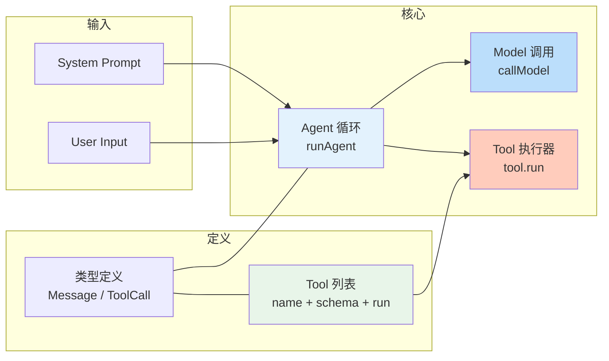
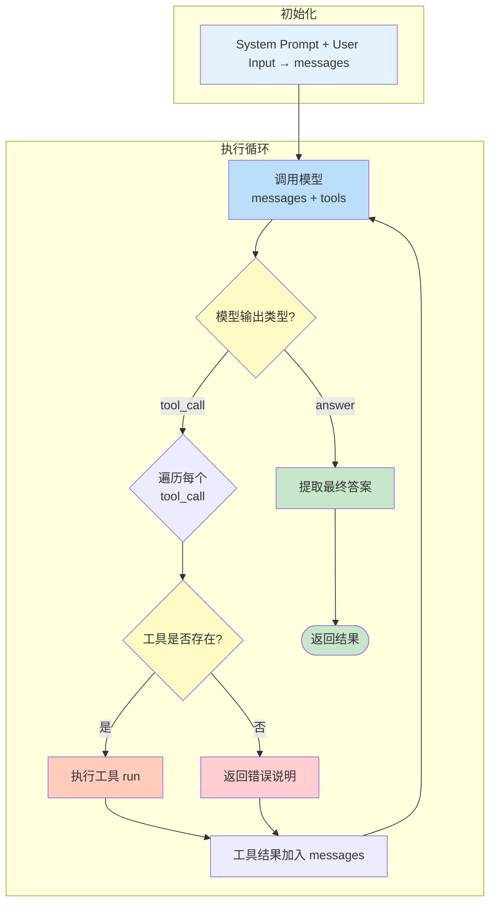
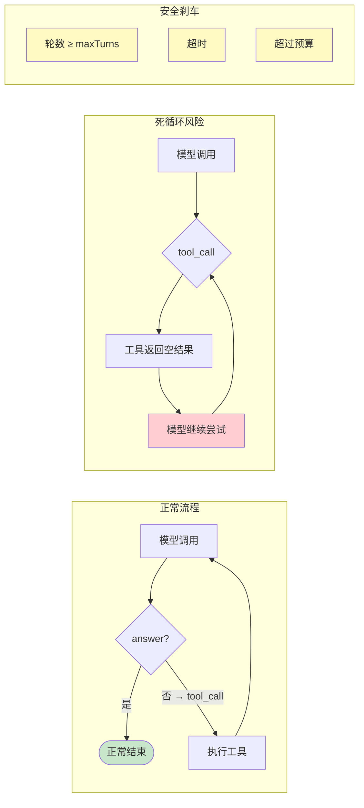

# 02 第一个可运行 Agent

## 本章目标

这一章写一个最小 Agent。它不需要知识库，不需要复杂 UI，也不需要数据库。目标只有一个：让模型在循环中决定“回答”还是“调用工具”。

我们先用 TypeScript 风格的伪代码描述。你可以用任何语言实现。

## 项目结构

一个真实的最小 Agent 项目通常这样组织：

```
my-first-agent/
├── package.json          # 依赖管理
├── tsconfig.json         # TypeScript 配置
├── .env                  # API Key 等敏感配置
└── src/
    ├── index.ts          # 入口：组装并运行 Agent
    ├── agent.ts          # Agent 循环核心
    ├── tools.ts          # 工具定义和注册
    ├── llm.ts            # LLM 客户端封装
    ├── types.ts          # 共享类型定义
    └── validate.ts       # 工具参数校验
```

关键依赖（`package.json`）：

```json
{
  "dependencies": {
    "openai": "^4.0.0",
    "zod": "^3.22.0"
  },
  "devDependencies": {
    "typescript": "^5.3.0",
    "tsx": "^4.0.0"
  }
}
```

环境变量（`.env`）：

```
OPENAI_API_KEY=sk-xxxx
OPENAI_BASE_URL=https://api.openai.com/v1
MODEL_NAME=gpt-4o-mini
MAX_TURNS=10
```

## 最小结构

一个 Agent 至少需要三类输入：

- 用户消息。
- 系统提示词。
- 工具列表。

```ts
type ToolCall = {
  name: string;
  arguments: Record<string, unknown>;
};

type ModelResult =
  | { type: 'answer'; content: string }
  | { type: 'tool_call'; calls: ToolCall[] };

type Tool = {
  name: string;
  description: string;
  parameters: Record<string, unknown>;
  run: (args: Record<string, unknown>) => Promise<string>;
};
```

这套类型表达了 Agent 的核心分支：模型要么回答，要么请求工具。

整个最小 Agent 的模块关系如下：



## 第一个工具

先写一个没有风险的工具：

```ts
const getCurrentTime: Tool = {
  name: 'get_current_time',
  description: '获取当前时间',
  parameters: {
    type: 'object',
    properties: {
      timezone: { type: 'string', description: '时区，例如 Asia/Shanghai' }
    },
    required: ['timezone']
  },
  async run(args) {
    return `当前时间是 ${new Date().toISOString()}，请求时区是 ${args.timezone}`;
  }
};
```

工具有两个面：

- 给模型看的描述：名字、用途、参数。
- 给程序执行的函数：`run`。

这两个面必须保持一致。描述写得越清楚，模型越容易在正确时候调用。

## 真实的 LLM 调用

上一章的伪代码用 `callModel` 代替了真实的 API 调用。这里给出用 OpenAI SDK 的实现：

```ts
// src/llm.ts
import OpenAI from 'openai';

const client = new OpenAI({
  apiKey: process.env.OPENAI_API_KEY,
  baseURL: process.env.OPENAI_BASE_URL
});

type CallModelParams = {
  messages: { role: string; content: string }[];
  tools: Tool[];
};

export async function callModel(params: CallModelParams): Promise<ModelResult> {
  const response = await client.chat.completions.create({
    model: process.env.MODEL_NAME ?? 'gpt-4o-mini',
    messages: params.messages,
    tools: params.tools.map((t) => ({
      type: 'function',
      function: {
        name: t.name,
        description: t.description,
        parameters: t.parameters
      }
    })),
    tool_choice: 'auto',
    temperature: 0
  });

  const choice = response.choices[0];

  // 模型请求工具调用
  if (choice.finish_reason === 'tool_calls' && choice.message.tool_calls) {
    return {
      type: 'tool_call',
      calls: choice.message.tool_calls.map((tc) => ({
        name: tc.function.name,
        arguments: JSON.parse(tc.function.arguments)
      }))
    };
  }

  // 模型返回文本答案
  return {
    type: 'answer',
    content: choice.message.content ?? ''
  };
}
```

这里 `tool_choice: 'auto'` 让模型自主决定是否调用工具。关键点：

- `tools` 参数要把工具 schema 传给模型，格式是 OpenAI 的 function calling 协议
- `finish_reason` 区分是 `tool_calls` 还是 `stop`
- 工具参数是 JSON 字符串，需要 `JSON.parse` 解析
- `temperature: 0` 让模型输出更确定，减少幻觉，适合工具调用场景

## 工具参数校验

模型生成的参数不一定合法。需要用 zod 做运行时校验，而不是假设参数正确：

```ts
// src/validate.ts
import { z } from 'zod';

// 为 getCurrentTime 工具定义参数校验
const GetCurrentTimeSchema = z.object({
  timezone: z.string().describe('时区，例如 Asia/Shanghai')
});

// 通用参数校验函数
export function validateToolArgs(
  toolName: string,
  args: unknown
): { ok: true; data: unknown } | { ok: false; error: string } {
  switch (toolName) {
    case 'get_current_time':
      return validateSchema(GetCurrentTimeSchema, args);
    default:
      return { ok: false, error: `未知工具: ${toolName}` };
  }
}

function validateSchema<T>(schema: z.ZodType<T>, data: unknown) {
  const result = schema.safeParse(data);
  if (result.success) {
    return { ok: true, data: result.data };
  }
  return { ok: false, error: result.error.issues.map((i) => i.message).join('; ') };
}
```

参数校验不只是安全措施，也是在帮助模型。当模型生成的参数格式不对时，明确的错误信息比静默失败更有用。

## Agent 循环



最小循环的代码实现：

```ts
async function runAgent(input: {
  systemPrompt: string;
  userInput: string;
  tools: Tool[];
  maxTurns: number;
}) {
  const messages = [
    { role: 'system', content: input.systemPrompt },
    { role: 'user', content: input.userInput }
  ];

  for (let turn = 0; turn < input.maxTurns; turn++) {
    const result = await callModel({ messages, tools: input.tools });

    if (result.type === 'answer') {
      return result.content;
    }

    for (const call of result.calls) {
      const tool = input.tools.find((item) => item.name === call.name);
      if (!tool) {
        messages.push({
          role: 'tool',
          content: `工具不存在：${call.name}`
        });
        continue;
      }

      const output = await tool.run(call.arguments);
      messages.push({
        role: 'tool',
        content: output
      });
    }
  }

  return '任务没有在最大轮数内完成。';
}
```

这个循环已经是 Agent 的雏形。真实的系统会增加**参数校验、超时控制、重试机制**：

```ts
import { validateToolArgs } from './validate';

async function runAgent(input: {
  systemPrompt: string;
  userInput: string;
  tools: Tool[];
  maxTurns: number;
  timeoutMs?: number; // 单次工具调用的超时
}) {
  const messages = [
    { role: 'system', content: input.systemPrompt },
    { role: 'user', content: input.userInput }
  ];

  for (let turn = 0; turn < input.maxTurns; turn++) {
    const result = await callModel({ messages, tools: input.tools });

    if (result.type === 'answer') {
      return result.content;
    }

    for (const call of result.calls) {
      // 1. 参数校验
      const validation = validateToolArgs(call.name, call.arguments);
      if (!validation.ok) {
        messages.push({
          role: 'tool',
          content: `参数校验失败：${validation.error}`
        });
        continue;
      }

      // 2. 查找工具
      const tool = input.tools.find((item) => item.name === call.name);
      if (!tool) {
        messages.push({
          role: 'tool',
          content: `工具不存在：${call.name}`
        });
        continue;
      }

      // 3. 执行工具（带超时）
      try {
        const output = await withTimeout(
          tool.run(validation.data),
          input.timeoutMs ?? 10000
        );
        messages.push({ role: 'tool', content: output });
      } catch (error) {
        messages.push({
          role: 'tool',
          content: `工具调用失败：${String(error)}`
        });
      }
    }
  }

  return '任务没有在最大轮数内完成。';
}

// 带超时的 Promise 包装
function withTimeout<T>(promise: Promise<T>, ms: number): Promise<T> {
  return Promise.race([
    promise,
    new Promise<T>((_, reject) =>
      setTimeout(() => reject(new Error(`操作超时 (${ms}ms)`)), ms)
    )
  ]);
}
```

在真实项目中，`withTimeout` 应该配合 `AbortController` 使用，以便超时后还能释放底层资源。

这个循环已经是 Agent 的雏形。真正的系统会更复杂，但核心不会变。



## 为什么要有 maxTurns

Agent 可能陷入循环：

```txt
模型：我要调用搜索工具
工具：没有结果
模型：我要换个关键词再搜
工具：没有结果
模型：我要继续搜索
...
```

所以必须限制最大轮数。没有 `maxTurns` 的 Agent 不能上线。

常见限制包括：

- 最大模型调用次数。
- 最大工具调用次数。
- 最大运行时间。
- 最大 token 消耗。
- 最大费用。

工程上，任何循环都要有刹车。

## 错误如何返回给模型

工具失败时，不要直接让整个 Agent 崩溃。应该把错误变成模型可理解的观察结果：

```ts
try {
  const output = await tool.run(call.arguments);
  messages.push({ role: 'tool', content: output });
} catch (error) {
  messages.push({
    role: 'tool',
    content: `工具调用失败：${String(error)}`
  });
}
```

这样模型可以决定：

- 换一个工具。
- 修改参数重试。
- 向用户说明失败原因。
- 询问用户补充信息。

但注意，不是所有错误都应该让模型自己处理。支付、删除、权限等高风险动作失败，应该走业务错误处理，而不是交给模型猜。

## 重试机制

某些工具失败是临时的（网络抖动、限流、服务暂时不可用），应该自动重试。另一些是持久错误（参数非法、权限不足），重试只会浪费时间和额度。

```ts
type RetryableError = {
  type: 'retryable';
  message: string;
};

type FatalError = {
  type: 'fatal';
  message: string;
};

function classifyError(error: unknown): RetryableError | FatalError {
  const msg = String(error);
  // 可重试的错误
  if (
    msg.includes('timeout') ||
    msg.includes('rate limit') ||
    msg.includes('5xx') ||
    msg.includes('ECONNRESET') ||
    msg.includes('ETIMEDOUT')
  ) {
    return { type: 'retryable', message: msg };
  }
  // 其余视为致命错误
  return { type: 'fatal', message: msg };
}

async function withRetry<T>(
  fn: () => Promise<T>,
  maxRetries = 2
): Promise<T> {
  let lastError: unknown;

  for (let attempt = 0; attempt <= maxRetries; attempt++) {
    try {
      return await fn();
    } catch (error) {
      lastError = error;
      const classified = classifyError(error);

      if (classified.type === 'fatal') {
        throw error; // 致命错误，不重试
      }

      if (attempt < maxRetries) {
        // 指数退避：1s → 2s → 4s
        const delay = 1000 * Math.pow(2, attempt);
        await new Promise((r) => setTimeout(r, delay));
      }
    }
  }

  throw lastError;
}
```

使用时有几个要点：
- **幂等操作**才能安全重试。如果工具会创建订单、扣款等，重试前必须确认上次调用没有生效
- **重试次数不宜过多**。2-3 次足够，超过之后应该让模型或用户决定
- **写入型工具**建议使用幂等键，配合外部去重

## 速率限制

Agent 可能因为循环过快而触发 LLM API 的 rate limit。用 token bucket 算法控制调用频率：

```ts
class RateLimiter {
  private tokens: number;
  private lastRefill: number;

  constructor(
    private maxTokens: number,    // 最大令牌数
    private refillRate: number,   // 每秒补充速率
    private refillInterval: number // 补充间隔(ms)
  ) {
    this.tokens = maxTokens;
    this.lastRefill = Date.now();
  }

  async acquire(): Promise<void> {
    this.refill();

    if (this.tokens >= 1) {
      this.tokens -= 1;
      return;
    }

    // 令牌不足，等待补充
    const waitTime = this.refillInterval / this.refillRate;
    await new Promise((r) => setTimeout(r, waitTime));
    return this.acquire();
  }

  private refill() {
    const now = Date.now();
    const elapsed = now - this.lastRefill;
    const newTokens = Math.floor(elapsed / this.refillInterval) * this.refillRate;
    if (newTokens > 0) {
      this.tokens = Math.min(this.maxTokens, this.tokens + newTokens);
      this.lastRefill = now;
    }
  }
}

// 使用示例：每分钟最多 60 次调用
const limiter = new RateLimiter(60, 1, 1000);

async function callModelWithLimit(params: CallModelParams) {
  await limiter.acquire();
  return callModel(params);
}
```

速率限制放在 LLM 调用层，而不是工具调用层。因为 rate limit 通常来自模型 API，而不是工具 API。如果工具 API 也有频率限制，可以在工具执行器里再加一层。

## 模型选择

Agent 的效果很大程度上取决于底层模型。不同模型在工具调用、指令遵循和成本上差异很大。

| 模型 | 工具调用质量 | 上下文窗口 | 输入价格(每 M token) | 输出价格 | 延迟 |
|------|------------|-----------|-------------------|---------|------|
| GPT-4o | ★★★★★ | 128K | $2.50 | $10.00 | 中 |
| GPT-4o-mini | ★★★★ | 128K | $0.15 | $0.60 | 低 |
| Claude 3.5 Sonnet | ★★★★★ | 200K | $3.00 | $15.00 | 中 |
| Claude 3.5 Haiku | ★★★★ | 200K | $0.80 | $4.00 | 低 |
| DeepSeek V3 | ★★★★ | 128K | $0.27 | $1.10 | 低 |
| Qwen2.5-72B | ★★★ | 128K | $0.90 | $0.90 | 中 |

选型建议：

- **开发调试**：GPT-4o-mini 或 Claude Haiku，速度快、成本低
- **生产环境**：GPT-4o 或 Claude Sonnet，工具调用更稳定
- **成本敏感**：DeepSeek V3，性价比高
- **长上下文**：Claude Sonnet 的 200K 窗口有明显优势

不要一开始就用最强模型。先用小模型把流程跑通，再用强模型做质量控制。实际上很多 Agent 任务在换用更便宜的模型后效果并没有显著下降。

## 最小系统提示词

Agent 的系统提示词应该包含边界：

```txt
你是一个任务助手。
你可以回答用户问题，也可以调用工具。
当需要实时信息或外部数据时，优先调用工具。
不要编造工具结果。
如果工具失败，说明失败原因并给出下一步建议。
如果信息不足，先询问用户，不要猜测。
```

提示词不是越长越好。第一版只写行为边界，后面再逐步加入格式、风格、权限和业务规则。

## 本章练习

给最小 Agent 增加第二个工具：`calculator`。

要求：

1. 参数包含 `expression`。
2. 只允许四则运算，不允许执行任意代码。
3. 工具失败时返回错误说明。
4. Agent 能回答：“帮我算一下 38 * 17，然后告诉我当前时间。”

完成后，你就有了一个可以多轮调用工具的最小 Agent。
