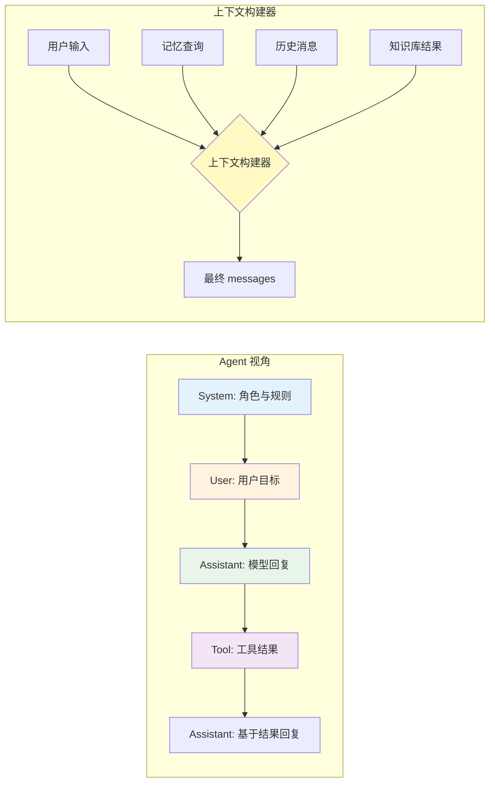
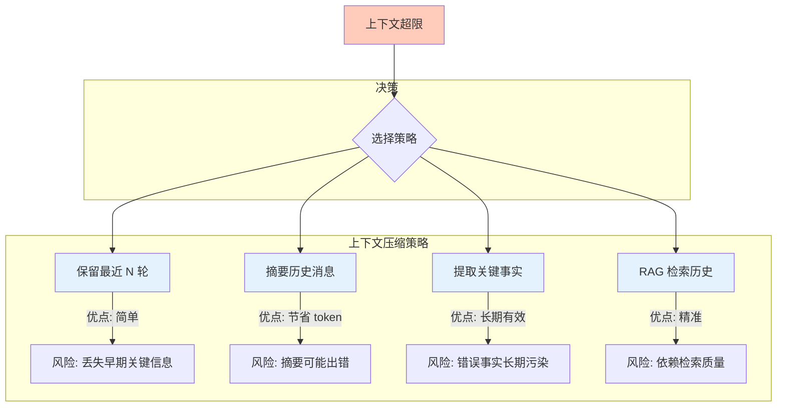
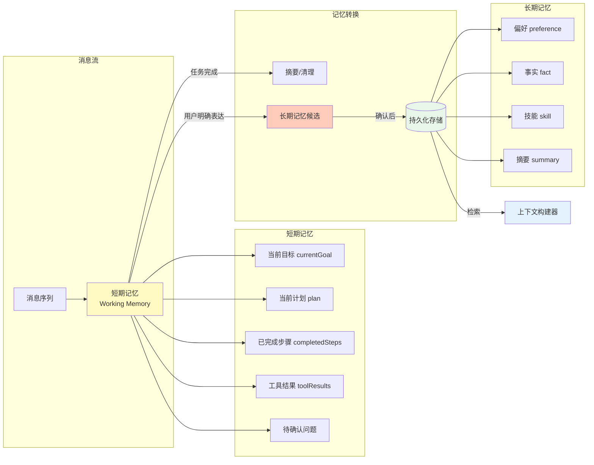

# 03 消息、上下文与记忆

## 本章目标

Agent 的能力不只来自模型，还来自它能看到什么。上下文决定 Agent 当下能理解什么，记忆决定 Agent 未来能延续什么。

本章会讲：

- messages 应该如何组织。
- 上下文窗口为什么会成为瓶颈。
- 短期记忆和长期记忆的区别。
- 如何避免错误记忆污染系统。



## messages 是运行时的时间线

模型看到的不是“真实世界”，而是一组消息：

```ts
type Message = {
  role: 'system' | 'user' | 'assistant' | 'tool';
  content: string;
};
```

这些消息构成了 Agent 的时间线：

```txt
system: 你是一个任务助手
user: 帮我查今天的会议安排
assistant: 我需要调用日历工具
tool: 今天 15:00 有项目评审会
assistant: 你今天 15:00 有项目评审会
```

如果消息顺序错了，Agent 的理解也会错。

## system 消息

system 消息定义角色、边界和规则。它应该回答：

- Agent 是谁？
- 可以做什么？
- 不可以做什么？
- 什么时候需要调用工具？
- 什么时候必须询问用户？
- 输出应该是什么格式？

不要把大量业务资料塞进 system。资料应该通过知识库或上下文注入，而不是让 system 变成垃圾桶。

## user 消息

user 消息是用户目标。要尽量保留原文，因为用户措辞里常常包含重要意图。

如果你做了意图改写，最好同时保留：

- 原始输入。
- 改写后的任务。
- 改写原因。

这样出错时更容易调试。

## assistant 消息

assistant 消息记录模型已经说过什么。它有两个用途：

- 让对话连续。
- 让 Agent 知道自己之前做过哪些判断。

如果 assistant 消息里包含错误结论，后续模型可能继续沿着错误方向走。所以生产系统要允许修正、裁剪或总结历史。

## tool 消息

tool 消息是外部世界的观察结果。它应该尽量结构化：

```json
{
  "ok": true,
  "data": {
    "orderId": "A1001",
    "status": "shipped"
  }
}
```

比起一段自然语言，结构化结果更稳定。模型可以读自然语言，但程序更容易检查 JSON。

消息的时间线必须是线性的。如果顺序错乱，Agent 的理解也会错乱。

## 上下文窗口

模型一次能看到的 token 有上限。对话越长，越容易超过窗口。



常见处理方式：

| 方法 | 优点 | 风险 |
| --- | --- | --- |
| 保留最近 N 轮 | 简单 | 可能丢失早期关键信息 |
| 摘要历史 | 节省 token | 摘要可能出错 |
| 重要事实记忆 | 长期有效 | 写错会长期污染 |
| RAG 检索历史 | 精准 | 需要检索质量 |

实际系统通常组合使用。

### Token 计数与预算管理

在代码中控制上下文大小，而不是依赖模型自己截断：

```ts
// 使用 gpt-tokenizer 或 tiktoken 进行 token 计数
import { encode } from 'gpt-tokenizer';

function countTokens(text: string): number {
  return encode(text).length;
}

function countMessagesTokens(messages: Message[]): number {
  return messages.reduce((sum, m) => sum + countTokens(m.content), 0);
}

/**
 * 在预算内裁剪消息列表
 * 策略：优先保留 system 和最近的 user/assistant 消息
 */
function trimMessages(
  messages: Message[],
  maxTokens: number,
  reserveRatio = 0.2
): Message[] {
  const reserveForOutput = Math.floor(maxTokens * reserveRatio);
  const available = maxTokens - reserveForOutput;

  // 始终保留 system 消息
  const systemMessages = messages.filter((m) => m.role === 'system');
  const nonSystem = messages.filter((m) => m.role !== 'system');

  let total = countMessagesTokens(systemMessages);
  const result = [...systemMessages];

  // 从最新的消息开始，向前添加
  for (let i = nonSystem.length - 1; i >= 0; i--) {
    const msgTokens = countTokens(nonSystem[i].content);
    if (total + msgTokens > available) break;
    result.push(nonSystem[i]);
    total += msgTokens;
  }

  return result;
}
```

这个函数的策略是保留 system 消息和最近的对话。如果需要保留早期关键信息，可以在裁剪前对早期消息做摘要，然后把摘要作为一条 system 消息插入。

### 摘要策略对比

下面给出三种策略的实现和适用场景：

```ts
type Summarizer = (messages: Message[]) => string;

// 策略 1：滚动窗口——只取最近 N 条消息
function rollingWindow(messages: Message[], maxCount = 20): Message[] {
  if (messages.length <= maxCount) return messages;

  const system = messages.filter((m) => m.role === 'system');
  const recent = messages.slice(-maxCount + system.length);
  return [...system, ...recent];
}

// 策略 2：关键信息抽取——用模型提取事实
async function extractKeyFacts(
  messages: Message[],
  llm: (prompt: string) => Promise<string>
): Promise<string> {
  const history = messages
    .filter((m) => m.role !== 'system')
    .map((m) => `[${m.role}] ${m.content}`)
    .join('\n');

  const summary = await llm(
    `从以下对话中提取关键事实，只保留对后续任务有影响的信息：
     - 用户已经提供的信息
     - 已经确认的结论
     - 当前未完成的任务
     - 用户的偏好和约束

     对话内容：
     ${history}`
  );

  return summary;
}

// 策略 3：混合策略——窗口 + 摘要
async function hybridStrategy(
  messages: Message[],
  maxTokens: number,
  llm: (prompt: string) => Promise<string>
): Promise<Message[]> {
  const systemMessages = messages.filter((m) => m.role === 'system');

  // 如果整体没超限，不需要处理
  if (countMessagesTokens(messages) <= maxTokens) {
    return messages;
  }

  // 对旧消息做摘要
  const recentCount = Math.min(6, messages.length - systemMessages.length);
  const recentMessages = messages.slice(-recentCount);
  const oldMessages = messages.slice(systemMessages.length, -recentCount);

  const summary = await extractKeyFacts(oldMessages, llm);

  return [
    ...systemMessages,
    { role: 'system', content: `历史摘要：${summary}` },
    ...recentMessages
  ];
}
```

| 策略 | 实现复杂度 | Token 节省 | 信息丢失风险 | 适用场景 |
|------|-----------|-----------|------------|---------|
| 滚动窗口 | 低 | 中 | 高 | 简单对话、客服 |
| 关键信息抽取 | 高 | 高 | 中 | 复杂任务、分析场景 |
| 混合策略 | 中 | 高 | 低 | 大多数生产场景 |

建议第一版用滚动窗口实现，因为最简单。当遇到"模型忘记了早期信息"的问题时，再升级到混合策略。

### Token 预算监控

每次 Agent Run 结束后，记录 token 消耗，用于分析和成本控制：

```ts
type TokenBudget = {
  maxInputTokens: number;
  maxOutputTokens: number;
  maxTotalTokens: number;
};

type TokenUsage = {
  inputTokens: number;
  outputTokens: number;
  totalTokens: number;
};

function trackTokenUsage(
  messages: Message[],
  modelResponse: string
): TokenUsage {
  return {
    inputTokens: countMessagesTokens(messages),
    outputTokens: countTokens(modelResponse),
    totalTokens: countMessagesTokens(messages) + countTokens(modelResponse)
  };
}

// 在 Agent 循环中检查预算
function checkBudget(usage: TokenUsage, budget: TokenBudget): boolean {
  if (usage.inputTokens > budget.maxInputTokens) return false;
  if (usage.outputTokens > budget.maxOutputTokens) return false;
  if (usage.totalTokens > budget.maxTotalTokens) return false;
  return true;
}
```

没有 token 监控，你就不知道 Agent 为什么突然变慢或者变贵。

## 短期记忆

短期记忆属于当前任务。比如：

```ts
type WorkingMemory = {
  currentGoal: string;
  plan: string[];
  completedSteps: string[];
  toolResults: unknown[];
};
```

短期记忆适合保存：

- 当前目标。
- 当前计划。
- 已完成步骤。
- 待确认问题。
- 临时工具结果。

任务结束后，短期记忆可以清理或摘要。



## 长期记忆

长期记忆跨任务保存。比如：

```ts
type LongTermMemory = {
  userId: string;
  kind: 'preference' | 'fact' | 'skill' | 'summary';
  content: string;
  confidence: number;
  updatedAt: string;
};
```

长期记忆一定要有置信度和更新时间。不要把模型随口推断的内容永久保存。

## 记忆写入规则

建议只在满足这些条件时写入长期记忆：

1. 用户明确表达了偏好或事实。
2. 信息对未来任务有复用价值。
3. 不涉及敏感隐私，或者用户授权保存。
4. 可以被用户查看和删除。
5. 不与已有记忆冲突。

错误示例：

```txt
用户：这次报告写得短一点。
系统记忆：用户永远喜欢短报告。
```

正确做法：

```txt
短期记忆：本次报告要求简洁。
长期记忆候选：用户可能偏好简洁输出，需后续确认。
```

## 记忆持久化

短期记忆在进程内存中即可。长期记忆需要持久化存储。这里给出基于文件系统的实现，生产环境可替换为 Redis 或数据库：

```ts
import * as fs from 'fs/promises';
import * as path from 'path';

type MemoryRecord = {
  key: string;
  userId: string;
  kind: 'preference' | 'fact' | 'summary';
  content: string;
  confidence: number;  // 0-1，低置信度记忆需要更多确认
  createdAt: number;
  updatedAt: number;
  ttl?: number;        // 过期时间戳，可选
};

class FileMemoryStore {
  private filePath: string;
  private cache: Map<string, MemoryRecord> = new Map();

  constructor(baseDir: string) {
    this.filePath = path.join(baseDir, 'memories.json');
  }

  async init(): Promise<void> {
    try {
      const data = await fs.readFile(this.filePath, 'utf-8');
      const records: MemoryRecord[] = JSON.parse(data);
      // 过滤已过期的记录
      const now = Date.now();
      for (const r of records) {
        if (r.ttl && now > r.ttl) continue;
        this.cache.set(r.key, r);
      }
    } catch {
      // 文件不存在，首次初始化
      await this.flush();
    }
  }

  async save(record: MemoryRecord): Promise<void> {
    record.updatedAt = Date.now();
    this.cache.set(record.key, record);
    await this.flush();
  }

  async query(userId: string, kind?: string): Promise<MemoryRecord[]> {
    const results: MemoryRecord[] = [];
    for (const record of this.cache.values()) {
      if (record.userId !== userId) continue;
      if (kind && record.kind !== kind) continue;
      results.push(record);
    }
    // 按置信度降序排列
    return results.sort((a, b) => b.confidence - a.confidence);
  }

  async delete(key: string): Promise<void> {
    this.cache.delete(key);
    await this.flush();
  }

  private async flush(): Promise<void> {
    const data = JSON.stringify(Array.from(this.cache.values()), null, 2);
    await fs.writeFile(this.filePath, data, 'utf-8');
  }
}
```

使用要点：

- **写入频率控制**：每次 save 都写磁盘效率低，可以用 debounce 合并写入，或者批量写入
- **竞争条件**：文件系统没有原子性保证。生产环境用 Redis 的原子操作或数据库事务
- **TTL 过期**：不是所有记忆都要永久保存。低置信度的记忆短期内未确认就可以自动清理
- **版本迁移**：记忆数据结构可能变化，需要向前兼容的读写逻辑

## 上下文构建器

不要在业务代码里到处拼 prompt。应该有一个上下文构建器：

```ts
type ContextBuilderInput = {
  systemPrompt: string;
  userInput: string;
  recentMessages: Message[];
  workingMemory?: WorkingMemory;
  retrievedMemories?: LongTermMemory[];
  toolResults?: unknown[];
  maxTokens?: number;
};

type ContextBuilder = {
  build(input: ContextBuilderInput): Message[];
};

class DefaultContextBuilder implements ContextBuilder {
  constructor(
    private maxTokens: number = 8000,
    private reserveRatio: number = 0.2
  ) {}

  build(input: ContextBuilderInput): Message[] {
    const parts: Message[] = [];

    // 1. system prompt
    parts.push({ role: 'system', content: input.systemPrompt });

    // 2. 长期记忆（已格式化的关键事实）
    if (input.retrievedMemories?.length) {
      const memories = this.formatMemories(input.retrievedMemories);
      if (memories) {
        parts.push({ role: 'system', content: memories });
      }
    }

    // 3. 短期记忆（当前计划、已完成步骤）
    if (input.workingMemory) {
      const wm = this.formatWorkingMemory(input.workingMemory);
      if (wm) {
        parts.push({ role: 'system', content: wm });
      }
    }

    // 4. 最近的历史消息
    parts.push(...input.recentMessages);

    // 5. 当前用户输入
    parts.push({ role: 'user', content: input.userInput });

    // 6. 在预算内裁剪
    return trimMessages(parts, this.maxTokens, this.reserveRatio);
  }

  private formatMemories(memories: LongTermMemory[]): string {
    const valid = memories.filter((m) => m.confidence > 0.5);
    if (valid.length === 0) return '';

    const lines = valid.map(
      (m) => `[${m.kind}] ${m.content} (置信度: ${m.confidence})`
    );
    return `以下是关于用户的已知信息：\n${lines.join('\n')}`;
  }

  private formatWorkingMemory(wm: WorkingMemory): string {
    const parts: string[] = [];

    if (wm.currentGoal) {
      parts.push(`当前目标：${wm.currentGoal}`);
    }
    if (wm.completedSteps?.length) {
      parts.push(`已完成步骤：${wm.completedSteps.join(' → ')}`);
    }
    if (wm.plan?.length) {
      parts.push(`剩余步骤：${wm.plan.join(' → ')}`);
    }

    return parts.length > 0 ? parts.join('\n') : '';
  }
}
```

上下文构建器是 Agent 系统的核心模块之一。它决定模型看到什么，也决定模型看不到什么。好的上下文构建器应该做到：
- **按优先级排列**：system prompt > 长期记忆 > 短期记忆 > 历史消息 > 当前输入
- **预算感知**：知道上下文窗口上限，在预算内组合内容
- **可调试**：每次构建后输出实际的消息数量和 token 使用量

## 本章练习

给上一章的 Agent 增加短期记忆：

1. 保存当前目标。
2. 保存每次工具调用结果。
3. 当超过 10 条消息时，把旧消息摘要成一条 summary。
4. 让 Agent 在最终回答里说明自己用了哪些工具结果。

完成后，你的 Agent 就不再只是无状态循环，而是有了任务连续性。
