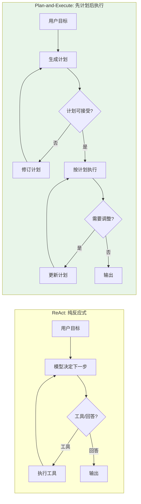
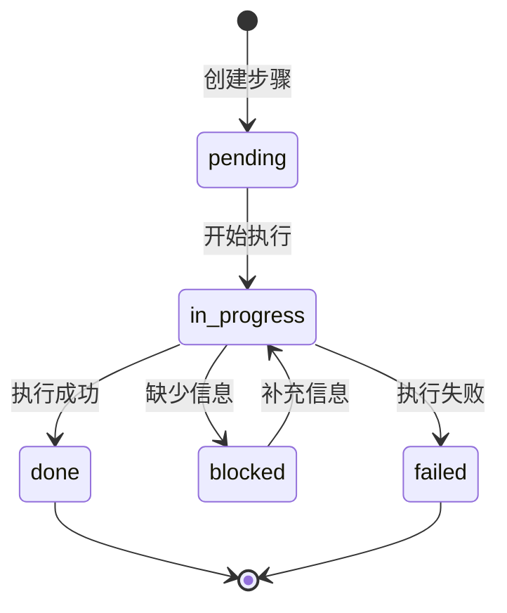

# 04 任务拆解与计划

## 本章目标

复杂任务需要计划。没有计划的 Agent 容易出现三个问题：乱调工具、忘记目标、过早给出答案。

本章会讲：

- 为什么需要计划。
- 计划应该长什么样。
- 如何让模型更新计划。
- 什么时候允许 Agent 停止。

## 计划 vs 纯反应式

没有计划的 Agent 在每一步都从头决定做什么。有计划之后，Agent 先拆解再执行。



| 维度 | ReAct | Plan-and-Execute |
|------|-------|------------------|
| 灵活性 | 高，随时可以转向 | 中，计划可能过早约束 |
| 可控性 | 低，难以预测下一步 | 高，步骤清晰可审计 |
| 错误恢复 | 自然恢复 | 需要主动修订计划 |
| 适用场景 | 简单多步、探索性任务 | 复杂任务、合规要求高场景 |

## 为什么需要计划

用户常常给的是目标，不是步骤：

```txt
帮我分析这份用户反馈，找出最重要的问题，并写一份改进建议。
```

这个目标至少包含：

1. 读取反馈。
2. 清洗和分类。
3. 统计高频问题。
4. 判断优先级。
5. 生成建议。
6. 输出报告。

如果没有计划，模型可能直接写一份泛泛而谈的建议。计划让 Agent 在行动前先形成可检查的路线。

## 计划的数据结构

计划不要只是一段自然语言。建议结构化：



```ts
type PlanStep = {
  id: string;
  title: string;
  status: 'pending' | 'in_progress' | 'done' | 'blocked';
  evidence?: string;
};

type Plan = {
  goal: string;
  steps: PlanStep[];
};
```

每一步都应该能被验证。比如“分析数据”太宽泛，“统计每类反馈数量”更可执行。

## 计划不是越细越好

太粗的问题是不可执行，太细的问题是成本高。

不好的计划：

```txt
1. 完成任务。
```

过细的计划：

```txt
1. 打开文件。
2. 读取第一行。
3. 读取第二行。
4. 读取第三行。
```

合适的计划：

```txt
1. 读取反馈数据并识别字段。
2. 按主题聚类反馈。
3. 统计每类反馈的数量和代表样例。
4. 生成优先级排序。
5. 输出改进建议。
```

## 计划生成

可以让模型先生成计划。不同的 prompt 风格会影响计划的粗细程度：

### 风格 1：简洁指令式

```txt
请先给出解决任务的步骤，不要开始执行。

要求：
- 每一步必须可验证（例如"统计数量"好于"分析数据"）
- 每步只做一个事情
- 如果缺少信息，标注 ⏳
- 如果步骤有依赖关系，标注依赖
```

适合：模型能力较强、任务明确时。

### 风格 2：结构化输出式

```txt
请输出 JSON 格式的计划：

{
  "goal": "任务目标",
  "steps": [
    { "id": "1", "title": "步骤描述", "dependsOn": [] }
  ]
}

约束：
- 步骤 3-7 步
- 每步 title 不超过 15 字
- 不要包含你已经无法执行的操作
```

适合：需要程序化解析计划、做后续校验时。

### 风格 3：追问优先式

```txt
在制定计划前，先确认你是否缺少关键信息。如果需要确认，请先询问用户，不要猜测。

如果信息充足，请给出步骤：
1. 每一步描述具体做什么
2. 哪些步骤可以并行
3. 哪些步骤需要用户确认
```

适合：高风险任务、信息容易缺失的场景。

```ts
// 计划生成的调用代码
async function generatePlan(
  userInput: string,
  llm: (messages: { role: string; content: string }[]) => Promise<string>
): Promise<Plan> {
  const response = await llm([
    {
      role: 'system',
      content: `你是一个任务规划助手。请将用户目标拆解为可执行的步骤。
输出 JSON 格式：{ "goal": string, "steps": [{ "id": string, "title": string }] }
步骤数量 3-7 步，每步必须具体、可验证。`
    },
    { role: 'user', content: userInput }
  ]);

  // 解析 JSON 响应；如果解析失败，回退到默认计划
  try {
    const plan = JSON.parse(response);

    // 给每个步骤增加默认状态
    return {
      goal: plan.goal,
      steps: plan.steps.map((s: { id: string; title: string }) => ({
        id: s.id,
        title: s.title,
        status: 'pending' as const
      }))
    };
  } catch {
    return {
      goal: userInput,
      steps: [{ id: '1', title: '理解并执行任务', status: 'pending' }]
    };
  }
}
```

这一步把"想"和"做"分开。对复杂任务很有用。

## 计划状态管理器

把计划的操作封装成一个类，而不是到处修改状态：

```ts
type PlanStepStatus = 'pending' | 'in_progress' | 'done' | 'blocked' | 'failed';

type PlanStep = {
  id: string;
  title: string;
  status: PlanStepStatus;
  dependsOn?: string[];    // 前置步骤 ID
  evidence?: string;       // 执行结果摘要
  error?: string;          // 失败原因
};

type Plan = {
  goal: string;
  steps: PlanStep[];
};

class PlanManager {
  constructor(public plan: Plan) {}

  // 获取当前应该执行的步骤
  getNextStep(): PlanStep | null {
    const pending = this.plan.steps.filter(
      (s) =>
        s.status === 'pending' &&
        (!s.dependsOn ||
          s.dependsOn.every((depId) => {
            const dep = this.plan.steps.find((d) => d.id === depId);
            return dep?.status === 'done' || dep?.status === 'skipped';
          }))
    );
    return pending[0] ?? null;
  }

  // 开始执行某一步
  startStep(stepId: string): boolean {
    const step = this.plan.steps.find((s) => s.id === stepId);
    if (!step || step.status !== 'pending') return false;
    step.status = 'in_progress';
    return true;
  }

  // 完成某一步
  completeStep(stepId: string, evidence: string): void {
    const step = this.plan.steps.find((s) => s.id === stepId);
    if (step) {
      step.status = 'done';
      step.evidence = evidence;
    }
  }

  // 标记受阻
  blockStep(stepId: string, reason: string): void {
    const step = this.plan.steps.find((s) => s.id === stepId);
    if (step) {
      step.status = 'blocked';
      step.error = reason;
    }
  }

  // 标记失败
  failStep(stepId: string, error: string): void {
    const step = this.plan.steps.find((s) => s.id === stepId);
    if (step) {
      step.status = 'failed';
      step.error = error;
    }
  }

  // 所有必要步骤是否已完成
  isComplete(): boolean {
    return this.plan.steps.every(
      (s) => s.status === 'done' || s.status === 'failed'
    );
  }

  // 是否存在未解决的 blocker
  hasBlocker(): boolean {
    return this.plan.steps.some((s) => s.status === 'blocked');
  }

  // 插入新步骤（工具执行过程中发现需要额外步骤）
  insertStep(afterId: string, title: string): PlanStep {
    const afterIdx = this.plan.steps.findIndex((s) => s.id === afterId);
    const newStep: PlanStep = {
      id: `step-${Date.now()}`,
      title,
      status: 'pending',
      dependsOn: [afterId]
    };
    this.plan.steps.splice(afterIdx + 1, 0, newStep);
    return newStep;
  }
}
```

这个管理器的价值不在于代码多复杂，而在于把所有计划操作集中到一处。否则如果计划状态散落在代码各处，调试时很难追踪"谁改了计划"。

## 计划更新的完整循环

Agent 在每轮循环中应该先检查计划状态，再决定下一步：

```ts
async function runWithPlan(input: {
  systemPrompt: string;
  userInput: string;
  tools: Tool[];
  maxTurns: number;
}) {
  // 1. 生成初始计划
  const initialPlan = await generatePlan(input.userInput, callModel);
  const planManager = new PlanManager(initialPlan);

  const messages = [
    { role: 'system', content: input.systemPrompt },
    { role: 'user', content: input.userInput }
  ];

  for (let turn = 0; turn < input.maxTurns; turn++) {
    // 2. 检查计划状态
    if (planManager.isComplete()) {
      return summarizeResult(planManager.plan);
    }

    if (planManager.hasBlocker()) {
      // 有 blocker 时，询问用户而不是猜测
      const blockedStep = planManager.plan.steps.find(
        (s) => s.status === 'blocked'
      );
      return `我在执行"${blockedStep?.title}"时遇到问题：${blockedStep?.error}。请补充信息后重试。`;
    }

    // 3. 获取下一步开始执行
    const nextStep = planManager.getNextStep();
    if (nextStep) {
      planManager.startStep(nextStep.id);
      messages.push({
        role: 'system',
        content: `当前步骤：${nextStep.title}。完成此步骤后调用 update_plan 标记完成。`
      });
    }

    // 4. 调用模型
    const result = await callModel({ messages, tools: input.tools });

    if (result.type === 'answer') {
      // 标记当前步骤完成
      if (nextStep) {
        planManager.completeStep(nextStep.id, result.content);
      }
      continue;
    }

    // 5. 执行工具
    for (const call of result.calls) {
      if (call.name === 'update_plan') {
        // 内部工具：更新计划状态
        const update = call.arguments as UpdatePlanInput;
        switch (update.status) {
          case 'done':
            planManager.completeStep(update.stepId, update.evidence ?? '');
            break;
          case 'blocked':
            planManager.blockStep(update.stepId, update.evidence ?? '');
            break;
        }
        continue;
      }

      // 执行普通工具
      const tool = input.tools.find((t) => t.name === call.name);
      if (!tool) continue;

      const output = await tool.run(call.arguments);
      messages.push({ role: 'tool', content: output });

      // 工具执行成功 → 标记步骤完成
      if (nextStep) {
        planManager.completeStep(nextStep.id, String(output).slice(0, 200));
      }
    }
  }

  return '任务没有在最大轮数内完成。已完成步骤：' +
    JSON.stringify(planManager.plan.steps.filter((s) => s.status === 'done'));
}
```

这个循环的关键在于：**Agent 不是每轮凭空决定"下一步做什么"，而是基于计划状态机的指示**。这让执行过程可审计、可打断、可恢复。

## 停止条件

Agent 什么时候可以输出最终答案？简单的 `every(step.status === 'done')` 不够，需要更精细的判断：

```ts
type StopDecision = {
  canStop: boolean;
  reason: string;
  missingSteps: string[];
};

function evaluateStopCondition(planManager: PlanManager): StopDecision {
  const plan = planManager.plan;
  const missingSteps: string[] = [];
  let canStop = true;

  for (const step of plan.steps) {
    switch (step.status) {
      case 'done':
      case 'failed':
        continue; // 已处理，不影响停止

      case 'blocked':
        canStop = false;
        missingSteps.push(`${step.title} (阻塞: ${step.error})`);
        break;

      case 'in_progress':
        // 正在执行的步骤可以等它完成
        canStop = false;
        missingSteps.push(`${step.title} (正在执行)`);
        break;

      case 'pending':
        // 检查是否是可选步骤
        if (!step.dependsOn?.includes('optional')) {
          canStop = false;
          missingSteps.push(`${step.title} (未开始)`);
        }
        break;
    }
  }

  return {
    canStop,
    reason: canStop
      ? '所有必要步骤已完成'
      : `缺少必要步骤：${missingSteps.join('、')}`,
    missingSteps
  };
}
```

停止条件的四个等级：

| 等级 | 条件 | 行为 |
|------|------|------|
| 硬停止 | 达到 maxTurns / 用户取消 / 预算超限 | 直接终止，返回已完成的中间结果 |
| 正常停止 | 所有必要步骤 done | 输出最终答案 |
| 受阻停止 | 有 blocked 步骤 | 输出结果 + 向用户说明受阻原因 |
| 部分停止 | 关键步骤完成 + 剩余步骤可选 | 输出摘要 + 询问是否需要继续 |

在生产系统中，停止条件应该持续评估，而不是只在最后一轮检查。

## 什么时候不需要计划

不是所有任务都要计划。简单问答如果强制计划，会让体验变差。

可以按任务复杂度判断：

- 一步能回答：不需要计划。
- 需要一个工具：可以不显式计划。
- 需要多个工具或多轮推理：需要计划。
- 需要用户确认或高风险操作：必须计划。

## 追问用户

计划中如果出现 blocker，不要让模型猜。

```ts
type AskUser = {
  question: string;
  options?: string[];      // 可选选项
  required: boolean;       // 是否必须回答
  context?: string;        // 为什么需要这个信息
};

class AskManager {
  private pendingQuestions: AskUser[] = [];

  // Agent 调用此方法来询问用户
  ask(input: AskUser): void {
    this.pendingQuestions.push(input);
  }

  // 检查是否有待回答的问题
  hasPendingQuestions(): boolean {
    return this.pendingQuestions.length > 0;
  }

  // 格式化输出给用户
  formatQuestions(): string {
    return this.pendingQuestions
      .map(
        (q, i) =>
          `${i + 1}. ${q.question}${q.options ? ` (选项: ${q.options.join('/')})` : ''}${q.required ? ' [必填]' : ' [可选]'}`
      )
      .join('\n');
  }

  // 用户回答后清理
  clear(): void {
    this.pendingQuestions = [];
  }
}
```

示例场景：

```txt
目标：帮我给客户发邮件。
缺失：客户邮箱、邮件语气、是否需要附件。

Agent 询问：
1. 请提供客户邮箱地址 [必填]
2. 邮件语气应该正式还是友好？ [必填]
3. 是否需要包含附件？ [可选]

用户回答：
邮箱是 customer@example.com，语气正式。

Agent 更新计划：
- blocked → in_progress（已获取邮箱和语气）
- 继续执行剩余步骤
```

追问本质上也是一种工具（`ask_agent`），它暂停当前任务，等待用户补充信息。追问的质量很重要：

- **具体**：不要问"还有什么信息需要补充"，要问"请提供客户邮箱"
- **有选项**：给出选项比开放问题更容易获得准确回答
- **说明原因**：告诉用户为什么需要这个信息，增加信任

## 本章练习

给你的 Agent 增加计划能力：

1. 如果用户任务超过一句话，先生成计划。
2. 执行工具前标记当前步骤为 `in_progress`。
3. 工具成功后标记为 `done`，并保存 evidence。
4. 如果缺少信息，返回追问。
5. 只有所有必要步骤完成后才输出最终答案。

做完这一步，你的 Agent 会更慢一点，但可控性会明显提升。
