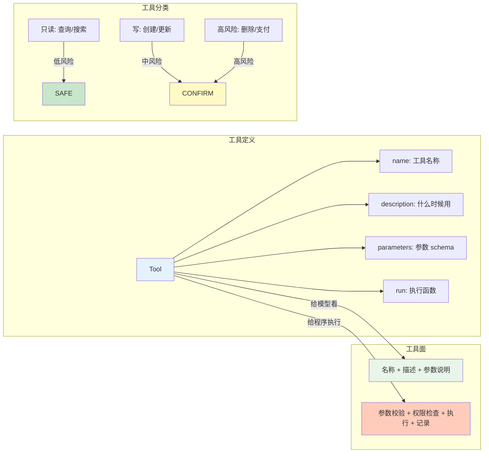
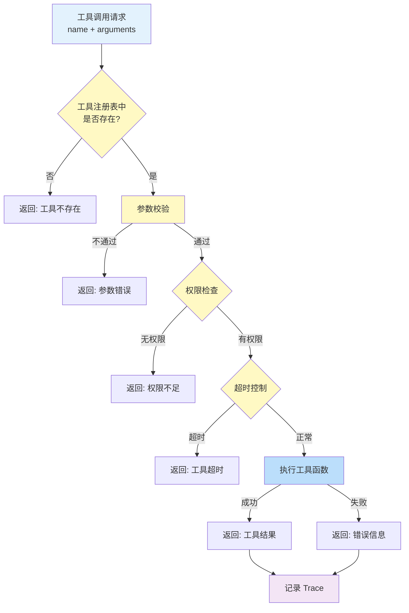
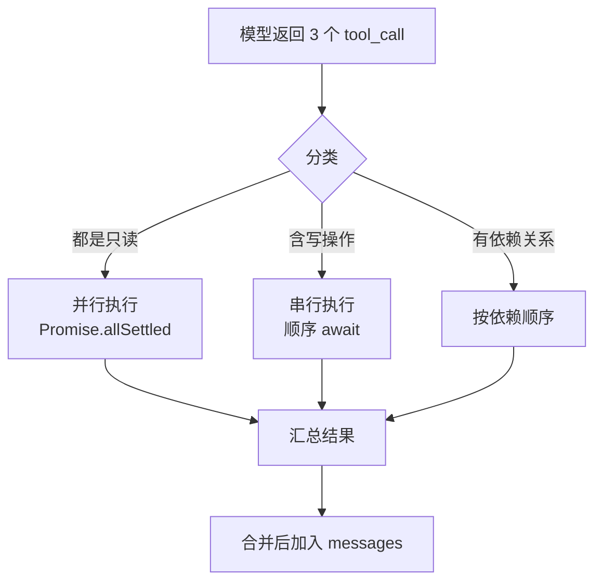

# 05 工具调用

## 本章目标

工具调用是 Agent 开发的分水岭。没有工具，模型只能生成文本；有了工具，Agent 才能查询数据、调用系统、读写文件、执行代码。

本章会讲：

- 工具的设计原则。
- 工具 schema 应该怎么写。
- 如何执行工具并处理错误。
- 如何控制工具权限和副作用。

## 工具是什么



工具是 Agent 可以调用的外部能力。

```ts
type Tool = {
  name: string;
  description: string;
  parameters: JsonSchema;
  run: (args: unknown, context: ToolContext) => Promise<ToolResult>;
};
```

工具不是 prompt。工具必须有真实执行逻辑。

常见工具包括：

- 搜索知识库。
- 查询数据库。
- 调用 HTTP API。
- 读取文件。
- 写入文件。
- 执行代码。
- 发送消息。
- 创建任务。

## 工具描述决定调用质量

模型选择工具时，主要看工具名、描述和参数说明。

不好的工具描述：

```txt
name: query
description: 查询东西
```

好的工具描述：

```txt
name: search_knowledge_base
description: 当用户问题需要基于内部文档、产品说明、制度或历史资料回答时，检索知识库并返回相关片段。
```

工具名应该具体。描述应该说明什么时候用、什么时候不用。

## HTTP 工具的完整实现

HTTP 工具是最常见的工具类型——Agent 通过它调用外部 API。下面是一个完整的实现：

```ts
import { z } from 'zod';

// HTTP 工具的参数 schema
const HttpRequestSchema = z.object({
  url: z.string().url().describe('请求 URL，支持 {{variable}} 模板'),
  method: z.enum(['GET', 'POST', 'PUT', 'DELETE', 'PATCH']).default('GET'),
  headers: z.record(z.string()).optional().describe('请求头'),
  body: z.unknown().optional().describe('请求体（POST/PUT 时使用）'),
  timeout: z.number().min(100).max(30000).default(5000)
});

type HttpRequestParams = z.infer<typeof HttpRequestSchema>;

async function httpRequestTool(
  args: unknown,
  context: ToolContext
): Promise<ToolResult> {
  // 1. 参数校验
  const parsed = HttpRequestSchema.safeParse(args);
  if (!parsed.success) {
    return { ok: false, error: parsed.error.message };
  }

  const { url, method, headers, body, timeout } = parsed.data;

  // 2. URL 模板变量替换
  const resolvedUrl = url.replace(/\{\{(\w+)\}\}/g, (_, key) => {
    return String((context.variables as Record<string, string>)?.[key] ?? '');
  });

  // 3. 构建请求
  const controller = new AbortController();
  const timeoutId = setTimeout(() => controller.abort(), timeout);

  try {
    const response = await fetch(resolvedUrl, {
      method,
      headers: {
        'Content-Type': 'application/json',
        ...headers,
        // 注入身份信息（不暴露给模型）
        'X-User-Id': context.userId,
        'X-Request-Id': context.requestId
      },
      body: body ? JSON.stringify(body) : undefined,
      signal: controller.signal
    });

    clearTimeout(timeoutId);

    // 4. 解析响应
    const data = await response.json();

    if (!response.ok) {
      return {
        ok: false,
        error: `HTTP ${response.status}: ${JSON.stringify(data)}`,
        displayText: `请求失败 (${response.status})`
      };
    }

    return {
      ok: true,
      data,
      displayText: `请求成功 (${response.status})`
    };
  } catch (error) {
    clearTimeout(timeoutId);

    if (error instanceof DOMException && error.name === 'AbortError') {
      return { ok: false, error: `请求超时 (${timeout}ms)` };
    }

    return { ok: false, error: `请求失败: ${String(error)}` };
  }
}
```

这个实现有几个工程要点：
- **AbortController** 实现超时控制，超时后释放连接
- **参数校验** 用 zod 在运行时做，而不是假设模型参数正确
- **URL 模板** 支持 `{{variable}}` 语法，允许 workflow 变量注入
- **身份透传** 通过 header 传递，不暴露给模型

## 参数 schema

参数应该尽量明确：

```ts
const searchKnowledgeBase = {
  name: 'search_knowledge_base',
  description: '检索知识库，返回与问题相关的资料片段',
  parameters: {
    type: 'object',
    properties: {
      query: {
        type: 'string',
        description: '用于检索的自然语言问题'
      },
      topK: {
        type: 'number',
        description: '最多返回多少条结果'
      }
    },
    required: ['query']
  }
};
```

不要把参数设计得太自由。参数越自由，越难校验，越容易误用。

## 工具结果

工具结果建议结构化：

```ts
type ToolResult = {
  ok: boolean;
  data?: unknown;
  error?: string;
  displayText?: string;
};
```

`data` 给程序和模型使用，`displayText` 给用户界面展示。两者可以不同。

比如知识库搜索结果：

```json
{
  "ok": true,
  "data": [
    {
      "title": "报销制度",
      "content": "单笔超过 5000 元需要部门负责人审批",
      "score": 0.82
    }
  ],
  "displayText": "找到 1 条相关资料"
}
```

## 工具执行器



不要让模型直接运行任意函数。应该有一个工具执行器：

```ts
class ToolRunner {
  constructor(private tools: Tool[]) {}

  async run(call: ToolCall, context: ToolContext) {
    const tool = this.tools.find((item) => item.name === call.name);
    if (!tool) {
      return { ok: false, error: `工具不存在：${call.name}` };
    }

    const validation = validate(tool.parameters, call.arguments);
    if (!validation.ok) {
      return { ok: false, error: validation.error };
    }

    return tool.run(call.arguments, context);
  }
}
```

工具执行器负责：

- 找工具。
- 校验参数。
- 检查权限。
- 处理超时。
- 捕获错误。
- 记录日志。

### 工具注册表

工具不应散落在代码中，而是集中注册和管理：

```ts
type ToolDefinition = {
  id: string;
  name: string;
  description: string;
  parameters: JsonSchema;
  riskLevel: 'low' | 'medium' | 'high';
  requiresConfirmation: boolean;
  executor: (args: unknown, context: ToolContext) => Promise<ToolResult>;
  metadata?: {
    author?: string;
    version?: string;
    tags?: string[];
    rateLimit?: { maxPerMinute: number };
  };
};

class ToolRegistry {
  private tools: Map<string, ToolDefinition> = new Map();

  register(tool: ToolDefinition): void {
    if (this.tools.has(tool.name)) {
      throw new Error(`工具重复注册: ${tool.name}`);
    }
    this.tools.set(tool.name, tool);
  }

  registerBatch(tools: ToolDefinition[]): void {
    for (const tool of tools) {
      this.register(tool);
    }
  }

  get(name: string): ToolDefinition | undefined {
    return this.tools.get(name);
  }

  getAll(): ToolDefinition[] {
    return Array.from(this.tools.values());
  }

  /**
   * 根据用户权限筛选可用的工具
   */
  getAvailable(userPermissions: string[]): ToolDefinition[] {
    return this.getAll().filter((t) =>
      t.requiresConfirmation
        ? userPermissions.includes(`${t.name}:execute`)
        : userPermissions.includes(`${t.name}:read`)
    );
  }

  /**
   * 为模型构建工具 schema（只暴露给模型的部分）
   */
  getToolSchemas(): JsonSchema[] {
    return this.getAll().map((t) => ({
      type: 'function',
      function: {
        name: t.name,
        description: t.description,
        parameters: t.parameters
      }
    }));
  }

  unregister(name: string): void {
    this.tools.delete(name);
  }
}

// 使用示例
const registry = new ToolRegistry();
registry.register({
  id: 'tool-get-order',
  name: 'get_order',
  description: '查询用户订单状态',
  parameters: {
    type: 'object',
    properties: {
      orderId: { type: 'string', description: '订单号' }
    },
    required: ['orderId']
  },
  riskLevel: 'medium',
  requiresConfirmation: false,
  executor: httpRequestTool
});
```

注册表的好处：
- **单一来源**：所有工具在一个地方注册和查询
- **权限绑定**：`getAvailable()` 自动过滤用户无权限的工具
- **Schema 导出**：`getToolSchemas()` 直接供模型调用
- **热加载**：可以在运行时动态注册/注销工具

## 并行工具调用

有些工具可以并行，有些不行。Agent 框架应该能自动判断：



```ts
type ToolCallBatch = {
  calls: ToolCall[];
  context: ToolContext;
  registry: ToolRegistry;
};

/**
 * 判断工具是否可以并行执行
 */
function canRunInParallel(calls: ToolCall[], registry: ToolRegistry): boolean {
  // 如果有写操作，必须串行
  for (const call of calls) {
    const def = registry.get(call.name);
    if (def?.riskLevel === 'high' || def?.riskLevel === 'medium') {
      return false;
    }
  }
  return true;
}

/**
 * 批量执行工具调用
 */
async function executeToolCalls(batch: ToolCallBatch): Promise<ToolResult[]> {
  const { calls, context, registry } = batch;

  if (canRunInParallel(calls, registry)) {
    // 并行执行所有只读工具
    const results = await Promise.allSettled(
      calls.map((call) => executeSingleTool(call, context, registry))
    );
    return results.map((r) =>
      r.status === 'fulfilled'
        ? r.value
        : { ok: false, error: r.reason }
    );
  }

  // 串行执行（含写操作）
  const results: ToolResult[] = [];
  for (const call of calls) {
    const result = await executeSingleTool(call, context, registry);
    results.push(result);

    // 如果写操作失败，终止后续工具
    if (!result.ok && registry.get(call.name)?.riskLevel !== 'low') {
      results.push(
        ...calls.slice(results.length).map(() => ({
          ok: false as const,
          error: '前置写操作失败，已终止执行'
        }))
      );
      break;
    }
  }
  return results;
}

async function executeSingleTool(
  call: ToolCall,
  context: ToolContext,
  registry: ToolRegistry
): Promise<ToolResult> {
  const def = registry.get(call.name);
  if (!def) {
    return { ok: false, error: `工具不存在: ${call.name}` };
  }

  // 写操作检查幂等性（见下一节）
  if (def.riskLevel !== 'low' && !call.arguments?.idempotencyKey) {
    return {
      ok: false,
      error: '写操作必须提供 idempotencyKey'
    };
  }

  return def.executor(call.arguments, context);
}
```

判断原则：
- 读操作（`riskLevel: 'low'`）通常可以并行，用 `Promise.allSettled` 处理部分失败
- 写操作通常要顺序执行，避免竞态条件
- 有依赖关系的工具必须顺序执行（比如先创建订单再支付）
- 高风险工具需要人工确认（见第 10 章）
- 写操作失败后，后续工具应该终止，而不是继续执行

## 工具权限

每个工具都应该有权限边界：

```ts
type ToolContext = {
  userId: string;
  tenantId: string;
  permissions: string[];
  requestId: string;
};
```

执行前检查：

```ts
if (!context.permissions.includes('orders:read')) {
  return { ok: false, error: '没有读取订单的权限' };
}
```

不要只靠 prompt 告诉模型“不要调用”。权限必须由程序执行。

## 副作用工具

副作用工具会改变外部状态：

- 删除数据。
- 发邮件。
- 扣款。
- 创建订单。
- 更新权限。

这类工具要更严格：

1. 参数强校验。
2. 幂等设计。
3. 操作前确认。
4. 操作后审计。
5. 失败可恢复。

可以把工具分级：

| 等级 | 类型 | 是否需要确认 |
| --- | --- | --- |
| safe | 只读查询 | 通常不需要 |
| low-risk | 创建草稿 | 可按场景决定 |
| high-risk | 发出邮件、删除数据、支付 | 必须确认 |

### 幂等设计

写操作必须考虑重复执行。网络超时后重试可能导致重复下单、重复扣款。

```ts
type IdempotentToolArgs = {
  idempotencyKey: string;  // 调用方生成，全局唯一
  payload: unknown;        // 实际业务参数
};

// 幂等存储
class IdempotencyStore {
  private store: Map<string, { status: 'pending' | 'done'; result?: unknown }> =
    new Map();

  /**
   * 尝试获取执行权
   * - 第一次调用：进入 pending 状态，返回 needExecute
   * - 重复调用：返回已缓存的结果
   */
  tryAcquire(key: string): {
    ok: boolean;
    status: 'duplicate' | 'first_call';
    result?: unknown;
  } {
    const existing = this.store.get(key);

    if (existing) {
      if (existing.status === 'done') {
        return { ok: true, status: 'duplicate', result: existing.result };
      }
      // 还在执行中
      return { ok: false, status: 'duplicate' };
    }

    this.store.set(key, { status: 'pending' });
    return { ok: true, status: 'first_call' };
  }

  complete(key: string, result: unknown): void {
    this.store.set(key, { status: 'done', result });
  }

  fail(key: string): void {
    this.store.delete(key); // 失败后可重试
  }
}

// 在工具执行器中使用
async function executeWithIdempotency(
  toolName: string,
  args: unknown,
  idempotencyStore: IdempotencyStore
): Promise<ToolResult> {
  const { idempotencyKey, payload } = args as IdempotentToolArgs;

  if (!idempotencyKey) {
    return { ok: false, error: '写操作缺少 idempotencyKey' };
  }

  const acquire = idempotencyStore.tryAcquire(idempotencyKey);

  if (acquire.status === 'duplicate') {
    return {
      ok: true,
      data: acquire.result,
      displayText: '操作已执行（幂等返回）'
    };
  }

  try {
    const result = await executeSingleTool(
      { name: toolName, arguments: payload },
      {} as ToolContext,
      {} as ToolRegistry
    );
    idempotencyStore.complete(idempotencyKey, result);
    return result;
  } catch (error) {
    idempotencyStore.fail(idempotencyKey);
    throw error;
  }
}
```

幂等设计要点：
- **IdempotencyKey** 由调用方（Agent 运行时）生成，通常是 `requestId + toolName + 序号` 的哈希
- **先查后写**：收到请求先检查是否已执行，避免重复
- **执行中状态**：防止同一 key 的并发写入
- **失败可重试**：失败后删除 key，允许下次正常执行

## 工具调用记录

每次工具调用都应该记录：

```ts
type ToolTrace = {
  toolName: string;
  arguments: unknown;
  result: unknown;
  ok: boolean;
  startedAt: string;
  endedAt: string;
  durationMs: number;
};
```

没有工具记录，就无法调试 Agent。

用户问“为什么你这么回答”，你也无法解释。

## 本章练习

实现三个工具：

1. `get_current_time`：只读工具。
2. `search_notes`：从本地数组中搜索笔记。
3. `create_todo`：创建待办事项，但执行前必须让用户确认。

要求：

- 每个工具都有 schema。
- 参数必须校验。
- 每次调用都保存 trace。
- `create_todo` 必须先返回确认请求，不能直接执行。

做完这一章，你的 Agent 已经具备真实行动能力。
