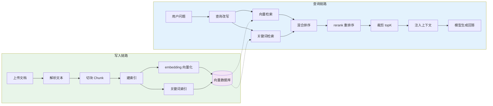
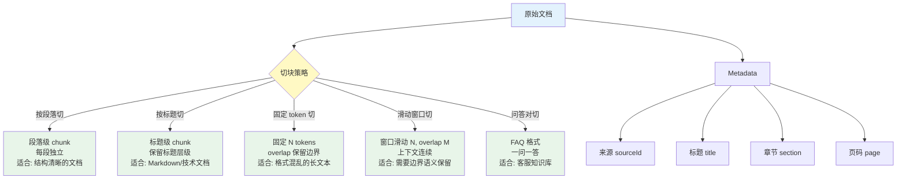
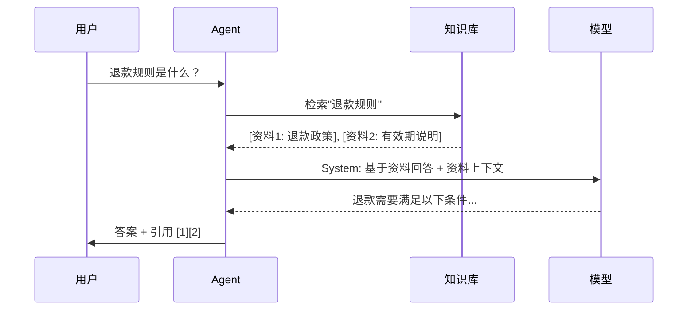

# 06 RAG 知识库

## 本章目标

RAG 是 Retrieval-Augmented Generation，也就是“检索增强生成”。它让 Agent 不只依赖模型参数，而是能先查资料，再基于资料回答。

本章会讲：

- 为什么需要知识库。
- 文档如何切块。
- 向量检索和关键词检索有什么区别。
- 如何把检索结果交给 Agent。
- 如何减少幻觉和错误引用。

## 为什么需要 RAG

模型有三个天然限制：

1. 不知道你的私有资料。
2. 训练数据可能过时。
3. 可能编造看似合理的答案。

知识库的作用是把回答建立在外部资料上：

```txt
用户问题 -> 检索相关资料 -> 把资料放进上下文 -> 模型基于资料回答
```

RAG 不是让模型“记住”资料，而是在回答前“查到”资料。

## 知识库的基本流程

一个完整知识库通常分两条链路。



很多初学者只关注查询，忽略写入。实际效果不好，常常是因为文档切块和索引阶段就做错了。

## 文档解析

文档可能来自：

- Markdown。
- PDF。
- Word。
- 网页。
- 表格。
- API 返回。

解析目标不是保留原始格式，而是得到适合检索的文本。

好的解析结果应该：

- 保留标题层级。
- 保留列表和表格含义。
- 去掉页眉页脚等噪声。
- 给图片或附件留下可追踪引用。

## 切块



模型不能一次读取整个文档，所以要切块。

一个 chunk 通常包含：

```ts
type Chunk = {
  id: string;
  text: string;
  metadata: {
    sourceId: string;
    title?: string;
    section?: string;
    page?: number;
  };
};
```

切块太大，检索不精准；切块太小，语义不完整。

常见策略：

| 策略 | 适用场景 |
| --- | --- |
| 按段落切 | 文档结构清晰 |
| 按标题切 | Markdown、技术文档 |
| 固定 token 切 | 格式混乱的长文本 |
| 滑动窗口切 | 需要保留上下文连续性 |
| 问答对切 | FAQ、客服知识 |

建议第一版使用“标题 + 段落 + 最大长度”的混合策略。

## Embedding 模型选型

Embedding 模型把文本转为向量。不同模型在精度、价格、语言支持和维度上差异很大。

| 模型 | 维度 | 每千文本价格 | 中文支持 | MTEB | 延迟 |
|------|------|------------|---------|------|------|
| text-embedding-3-small | 512-1536 | $0.02 | 好 | 62.3% | 低 |
| text-embedding-3-large | 256-3072 | $0.13 | 好 | 64.6% | 中 |
| bge-large-zh-v1.5 | 1024 | 免费(自部署) | 优秀 | 63.7% | 中 |
| bge-m3 | 1024 | 免费(自部署) | 优秀 | 64.2% | 中 |
| jina-embeddings-v3 | 1024 | 免费(自部署) | 好 | 64.5% | 中 |
| Cohere embed-v3 | 1024 | $0.10 | 中 | 64.0% | 低 |

选型建议：
- **快速验证**：text-embedding-3-small，便宜且 API 调用简单
- **中文场景**：bge-m3 或 bge-large-zh-v1.5，中文语义理解最好
- **精度优先**：text-embedding-3-large 或 jina-embeddings-v3
- **自部署**：BGE 系列，MIT 许可证，可商用

测试 embedding 质量的一个简单方法：准备 100 个查询-文档对，计算 recall@10。不同模型在这个指标上可能差 10-20 个百分点。

## 向量数据库选型

| 特性 | PGVector | Milvus | ChromaDB | Pinecone |
|------|---------|--------|----------|----------|
| 部署方式 | 自部署 | 自部署/云 | 自部署/嵌入式 | 仅云 |
| 运维成本 | 低(PostgreSQL 扩展) | 高(独立集群) | 极低 | 无 |
| 向量维度上限 | 2000 | 65535 | 无限制 | 无限制 |
| 混合搜索 | 原生 SQL + 向量 | 需要配置 | 有限 | 付费 |
| 标量过滤 | 强(SQL where) | 中等 | 基本 | 基本 |
| 开源 | 是 | 是 | 是 | 否 |
| 适合阶段 | 小到中型(千万级) | 大型(亿级) | 原型开发 | 生产托管 |

第一版建议用 PGVector。理由：不需要额外维护一个数据库，PostgreSQL 已经在用了，SQL 查询灵活，运维成本最低。

## 向量索引

向量检索的思路是：

```txt
文本 -> embedding 模型 -> 向量 -> 向量数据库
```

查询时：

```txt
问题 -> embedding -> 找最相似的 chunk
```

向量检索擅长语义相似：

```txt
用户问：怎么报销打车费？
资料写：交通费用 reimbursement policy
```

即使用词不同，也可能搜到。

## 关键词索引

关键词检索擅长精确匹配：

- 产品型号。
- 错误码。
- 人名。
- 函数名。
- 订单号。

向量检索不一定擅长这些。因此生产系统常用混合检索：

```txt
向量召回 + 关键词召回 -> 合并排序
```

## 查询改写

用户的问题不一定适合直接检索。

例如：

```txt
它怎么配置？
```

这里的“它”依赖历史上下文。查询改写会把它变成：

```txt
如何配置企业微信机器人回调地址？
```

查询改写可以使用模型完成，但要注意成本。简单场景可以先用最近对话拼接。

## 混合检索

在实际系统中，只靠向量检索或只靠关键词检索都有盲区。

```ts
type HybridSearchResult = {
  chunks: ScoredChunk[];
  vectorScore: number;
  keywordScore: number;
  finalScore: number;
};

type SearchStrategy = {
  vectorWeight: number;    // 向量检索权重 (0-1)
  keywordWeight: number;   // 关键词检索权重 (0-1)
  topK: number;            // 最终返回数量
  rerankTopK: number;      // rerank 候选数量
};

function hybridSearch(
  query: string,
  chunks: ScoredChunk[],
  strategy: SearchStrategy
): ScoredChunk[] {
  const { vectorWeight, keywordWeight, topK, rerankTopK } = strategy;

  // 1. 向量检索结果
  const vectorResults = vectorSearch(query, chunks, rerankTopK);

  // 2. 关键词检索结果（BM25 或简单关键词匹配）
  const keywordResults = keywordSearch(query, chunks, rerankTopK);

  // 3. 合并打分
  const merged = new Map<string, ScoredChunk>();

  for (const result of vectorResults) {
    merged.set(result.id, {
      ...result,
      finalScore: (result.score ?? 0) * vectorWeight
    });
  }

  for (const result of keywordResults) {
    const existing = merged.get(result.id);
    if (existing) {
      existing.finalScore += (result.score ?? 0) * keywordWeight;
      // 同时命中的加权
      existing.finalScore *= 1.2;
    } else {
      merged.set(result.id, {
        ...result,
        finalScore: (result.score ?? 0) * keywordWeight
      });
    }
  }

  // 4. 按综合得分排序
  return Array.from(merged.values())
    .sort((a, b) => b.finalScore - a.finalScore)
    .slice(0, topK);
}
```

权重调优建议：

| 场景 | vectorWeight | keywordWeight | 说明 |
|------|-------------|--------------|------|
| 通用问答 | 0.7 | 0.3 | 语义匹配为主 |
| 代码/文档 | 0.3 | 0.7 | 精确匹配重要 |
| 产品型号查询 | 0.2 | 0.8 | 关键词命中更重要 |
| 法律法规 | 0.5 | 0.5 | 均衡 |

## rerank

初次检索返回的是候选集，rerank 负责重新排序。

```txt
召回 50 条 -> rerank 取前 5 条
```

rerank 模型会更认真地比较“问题”和“片段”是否相关。它通常比直接向量相似度更准，但更慢、更贵。

## 检索质量评测

没有评测的检索系统是在碰运气。

```ts
type RetrievalEvalCase = {
  id: string;
  query: string;
  expectedChunkIds: string[];
};
```

用这个评测工具对比不同检索策略，你会发现混合检索通常比单一策略高 10-20 个百分点的 Recall。“问题”和“片段”是否相关。它通常比直接向量相似度更准，但更慢、更贵。



## 上下文注入

把检索结果交给模型时，不要只是拼一坨文本。

建议格式：

```txt
以下是可用资料。回答必须基于资料，不确定就说不知道。

[资料 1]
标题：报销制度
内容：单笔超过 5000 元需要部门负责人审批。

[资料 2]
标题：交通费说明
内容：打车费需提供发票和行程单。
```

同时告诉模型：

- 必须基于资料回答。
- 不要编造资料中没有的信息。
- 引用资料编号。
- 资料不足时说明不足。

## 引用

RAG 系统应该展示引用。引用的价值是：

- 用户能验证答案。
- 开发者能调试召回。
- 运营能发现知识库缺口。

引用至少包括：

```ts
type Citation = {
  sourceId: string;
  title: string;
  snippet: string;
  score: number;
};
```

不要只展示最终答案。没有引用的 RAG 很难建立信任。

## 常见问题

### 检索不到

可能原因：

- 文档没解析好。
- 切块太碎或太大。
- query 改写失败。
- 只用了向量检索，缺少关键词检索。
- 相似度阈值太高。

### 检索到了但回答错

可能原因：

- 资料太多，模型忽略关键片段。
- 资料互相冲突。
- prompt 没要求基于资料。
- 模型使用了自己的常识补全。

### 引用不准

可能原因：

- chunk 缺少 metadata。
- 多个 chunk 内容重复。
- rerank 只看相似度，不看可回答性。

## 最小 RAG 实现

可以先实现：

```ts
async function answerWithKnowledge(question: string) {
  const rewrittenQuery = await rewriteQuery(question);
  const chunks = await retrieveChunks(rewrittenQuery);
  const context = formatChunks(chunks);

  return model.chat([
    { role: 'system', content: '你必须基于资料回答。' },
    { role: 'user', content: `${context}\n\n问题：${question}` }
  ]);
}
```

第一版甚至可以不用向量数据库，用本地数组 + 简单关键词搜索。先把流程跑通，再替换检索实现。

## 本章练习

做一个本地知识库：

1. 准备 5 篇 Markdown 文档。
2. 按标题和段落切成 chunk。
3. 实现关键词检索。
4. 把前 3 条结果注入 prompt。
5. 要求模型回答时引用资料编号。

进阶练习：

1. 加入 embedding 检索。
2. 把关键词和向量结果合并。
3. 加入 rerank。
4. 对答案做“是否被引用支持”的检查。
