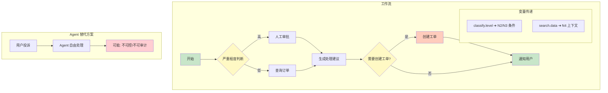
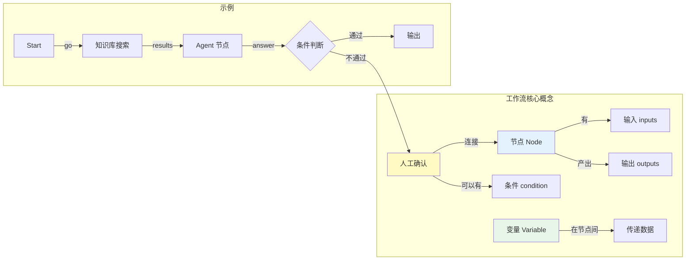

# 07 工作流编排

## 本章目标

Agent 擅长灵活决策，但不代表所有事情都应该交给模型自由发挥。工作流编排让复杂任务变得可控、可复用、可调试。

本章会讲：

- 工作流和 Agent 的关系。
- 节点、边、变量是什么。
- 如何设计一个最小工作流引擎。
- 什么时候用工作流，什么时候用 Agent。



## 为什么需要工作流

假设任务是：

```txt
收到用户投诉后，判断严重程度，查询订单，生成处理建议，必要时创建工单。
```

你可以让 Agent 自由处理。但企业系统通常希望：

- 严重程度判断规则稳定。
- 查询订单必须执行。
- 创建工单前必须确认。
- 每一步都有记录。

这时工作流更适合。



## 节点

节点是一个可执行步骤：

```ts
type WorkflowNode = {
  id: string;
  type: string;
  inputs: Record<string, unknown>;
};
```

常见节点：

- 输入节点。
- 条件判断节点。
- 知识库搜索节点。
- Agent 节点。
- 工具节点。
- 人工确认节点。
- 输出节点。

## 边

边表示执行顺序：

```ts
type WorkflowEdge = {
  source: string;
  target: string;
  condition?: string;
};
```

最简单的是顺序边：

```txt
start -> search -> agent -> answer
```

复杂一些可以有条件边：

```txt
classify -> highRisk -> humanReview
classify -> lowRisk -> autoReply
```

## 变量

节点输出要给后续节点使用，所以需要变量：

```ts
type WorkflowState = {
  variables: Record<string, unknown>;
};
```

例如：

```txt
search.results -> agent.context
classify.level -> if.condition
agent.answer -> output.text
```

变量系统是工作流的血管。没有变量，节点之间就只是孤立函数。

## 最小执行器

第一版只支持有向无环图：

```ts
async function runWorkflow(workflow: {
  nodes: WorkflowNode[];
  edges: WorkflowEdge[];
}) {
  const state = { variables: {} };
  const orderedNodes = topologicalSort(workflow.nodes, workflow.edges);

  for (const node of orderedNodes) {
    const result = await runNode(node, state);
    state.variables[node.id] = result;
  }

  return state;
}
```

先不要做循环、并行和可视化。最小执行器跑通后，再扩展。

### DAG 执行引擎

第一版工作流引擎应该基于拓扑排序实现有向无环图(DAG)执行。

```ts
type WorkflowNode = {
  id: string;
  type: string;
  inputs: Record<string, unknown>;
};

type WorkflowEdge = {
  source: string;
  target: string;
  condition?: string;
};

// 拓扑排序：确保节点按依赖顺序执行
function topologicalSort(
  nodes: WorkflowNode[],
  edges: WorkflowEdge[]
): WorkflowNode[] {
  const inDegree = new Map<string, number>();
  const adjacency = new Map<string, string[]>();

  for (const node of nodes) {
    inDegree.set(node.id, 0);
    adjacency.set(node.id, []);
  }

  for (const edge of edges) {
    adjacency.get(edge.source)?.push(edge.target);
    inDegree.set(edge.target, (inDegree.get(edge.target) ?? 0) + 1);
  }

  const queue: string[] = [];
  for (const [nodeId, degree] of inDegree) {
    if (degree === 0) queue.push(nodeId);
  }

  const sorted: WorkflowNode[] = [];
  while (queue.length > 0) {
    const nodeId = queue.shift()!;
    const node = nodes.find((n) => n.id === nodeId);
    if (node) sorted.push(node);

    for (const neighbor of adjacency.get(nodeId) ?? []) {
      const newDegree = (inDegree.get(neighbor) ?? 1) - 1;
      inDegree.set(neighbor, newDegree);
      if (newDegree === 0) queue.push(neighbor);
    }
  }

  if (sorted.length !== nodes.length) {
    throw new Error('工作流包含循环依赖，无法执行');
  }

  return sorted;
}

// 条件边求值
function evaluateCondition(condition: string, variables: Record<string, unknown>): boolean {
  // 支持格式: {{variable}} == 'value', {{variable}} > 100, {{variable}} exists
  const match = condition.match(/\{\{(\w+)\}\}\s*(==|!=|>|<|exists)\s*(.*)/);
  if (!match) return true;

  const [, varName, op, expected] = match;
  const actual = variables[varName];

  switch (op) {
    case '==': return String(actual) === expected.trim().replace(/^['"]|['"]$/g, '');
    case '!=': return String(actual) !== expected.trim().replace(/^['"]|['"]$/g, '');
    case '>': return Number(actual) > Number(expected);
    case '<': return Number(actual) < Number(expected);
    case 'exists': return actual !== undefined && actual !== null;
    default: return true;
  }
}
```

## 节点执行结果

节点结果建议统一：

```ts
type NodeResult = {
  ok: boolean;
  data?: Record<string, unknown>;
  error?: string;
  trace?: unknown;
};
```

统一结果的好处：

- 调试界面好做。
- 错误处理一致。
- 后续节点能读取上游状态。
- 可以记录每一步耗时和输入输出。

## Agent 节点

Agent 可以作为工作流中的一个节点：

```txt
知识库搜索 -> Agent 总结 -> 人工确认 -> 发送邮件
```

这样设计很实用：

- 工作流负责大方向和边界。
- Agent 负责需要语言理解和灵活处理的部分。

不要把整个流程都塞进 Agent。也不要把所有智能决策都写死成流程。二者要配合。

## 人工确认节点

很多任务需要暂停：

```txt
Agent 生成邮件草稿 -> 用户确认 -> 发送邮件
```

这类节点需要保存状态：

```ts
type PendingInteraction = {
  workflowRunId: string;
  nodeId: string;
  question: string;
  options?: string[];
};
```

用户回答后，工作流从暂停点继续执行。

## 什么时候用工作流

适合工作流：

- 步骤稳定。
- 合规要求高。
- 需要审批。
- 需要可视化配置。
- 多团队复用。

适合 Agent：

- 步骤不固定。
- 需要根据上下文判断。
- 需要处理自然语言。
- 需要探索式工具调用。

最佳实践通常是：**工作流包住 Agent，Agent 只在需要灵活性的节点里运行。**

## 本章练习

实现一个最小工作流：

```txt
start -> search_knowledge_base -> agent -> answer
```

要求：

1. 节点按顺序执行。
2. 每个节点保存输入、输出、耗时。
3. Agent 节点能读取知识库搜索结果。
4. 输出节点返回最终答案和引用。

完成后，你就有了一个可控的 RAG Agent 流程。
