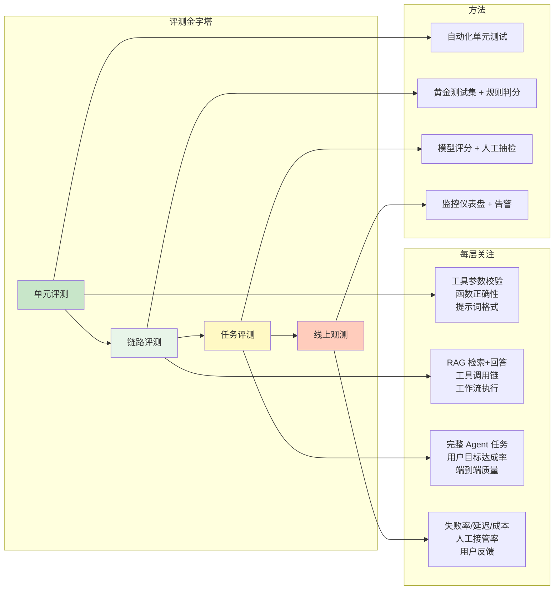
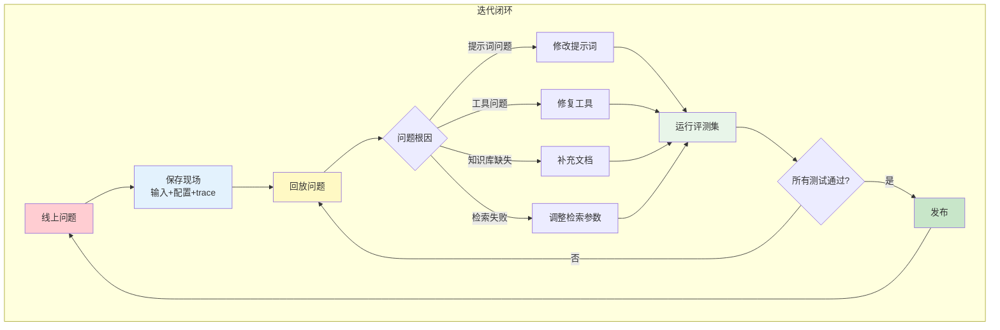

# 09 评测与可观测性

## 本章目标

Agent 能跑起来，不代表它可靠。一个 Agent 平台要长期可用，必须能回答三个问题：

- 它答得对吗？
- 它为什么这样答？
- 它什么时候会变差？

本章会讲：

- 如何给 Agent 做评测。
- 如何构造测试集。
- 如何记录 trace、日志和指标。
- 如何用回放定位问题。

## 为什么 Agent 更需要评测

传统程序通常输入确定、输出确定。Agent 不同：

- 模型输出有不确定性。
- 工具调用路径可能变化。
- 知识库内容会更新。
- 用户问题表达方式很多。
- 提示词改一行，行为可能变化。

所以 Agent 的质量不能只靠“我试了一下感觉还行”。你需要一套可重复运行的评测方法。

## 评测分层

Agent 评测可以分成四层：



- 单元评测看小模块是否正确，例如工具参数校验
- 链路评测看一个能力链是否正确，例如 RAG 检索和回答
- 任务评测看完整 Agent 是否完成目标
- 线上观测看真实用户场景中的表现

链路评测看一个能力链是否正确，例如 RAG 检索和回答。

任务评测看完整 Agent 是否完成目标，例如“帮用户分析一份合同风险”。

线上观测看真实用户场景中的表现，例如失败率、人工接管率、成本和延迟。

## 评测框架

一个可复用的评测框架至少包含三部分：测试集定义、运行器、报告生成。

```ts
// 1. 测试集定义
type EvalCase = {
  id: string;
  input: string;
  expected: {
    mustContain?: string[];
    mustNotContain?: string[];
    toolCalls?: string[];
    citations?: string[];
    expectedDurationMs?: number;
  };
};

type EvalSuite = {
  name: string;
  cases: EvalCase[];
  config?: {
    parallel?: boolean;
    timeout?: number;
    model?: string;
  };
};

// 2. 运行器
type EvalResult = {
  caseId: string;
  passed: boolean;
  checks: {
    mustContain: boolean;
    mustNotContain: boolean;
    toolCalls: boolean;
    citations: boolean;
  };
  actual: {
    answer: string;
    toolCalls: string[];
    citations: string[];
    durationMs: number;
  };
  errors: string[];
};

class EvalRunner {
  async runSuite(
    suite: EvalSuite,
    agentFn: (input: string) => Promise<AgentResponse>
  ): Promise<EvalResult[]> {
    const runSingle = async (testCase: EvalCase): Promise<EvalResult> => {
      const start = Date.now();
      let response: AgentResponse;

      try {
        response = await agentFn(testCase.input);
      } catch (error) {
        return {
          caseId: testCase.id,
          passed: false,
          checks: { mustContain: false, mustNotContain: false, toolCalls: false, citations: false },
          actual: { answer: '', toolCalls: [], citations: [], durationMs: Date.now() - start },
          errors: [String(error)]
        };
      }

      const durationMs = Date.now() - start;
      const answer = response.output ?? '';
      const toolCalls = response.toolCalls ?? [];
      const citations = response.citations ?? [];

      const checks = {
        mustContain: testCase.expected.mustContain?.every((t) => answer.includes(t)) ?? true,
        mustNotContain: testCase.expected.mustNotContain?.every((t) => !answer.includes(t)) ?? true,
        toolCalls: testCase.expected.toolCalls?.every((t) => toolCalls.includes(t)) ?? true,
        citations: testCase.expected.citations?.every((c) => citations.includes(c)) ?? true
      };

      return {
        caseId: testCase.id,
        passed: Object.values(checks).every(Boolean),
        checks,
        actual: { answer: answer.slice(0, 500), toolCalls, citations, durationMs },
        errors: []
      };
    };

    if (suite.config?.parallel) {
      return Promise.all(suite.cases.map(runSingle));
    }

    const results: EvalResult[] = [];
    for (const testCase of suite.cases) {
      results.push(await runSingle(testCase));
    }
    return results;
  }

  // 3. 报告生成
  generateReport(results: EvalResult[]): string {
    const total = results.length;
    const passed = results.filter((r) => r.passed).length;
    const passRate = ((passed / total) * 100).toFixed(1);

    const lines: string[] = [
      `# 评测报告`,
      `通过率: ${passRate}% (${passed}/${total})`,
      '',
      '| ID | 状态 | 包含检查 | 排除检查 | 工具调用 | 引用 | 延迟 |',
      '|---|---|---|---|---|---|---|'
    ];

    for (const r of results) {
      lines.push(
        `| ${r.caseId} | ${r.passed ? '✅' : '❌'} | ${r.checks.mustContain ? '✅' : '❌'} | ${r.checks.mustNotContain ? '✅' : '❌'} | ${r.checks.toolCalls ? '✅' : '❌'} | ${r.checks.citations ? '✅' : '❌'} | ${r.actual.durationMs}ms |`
      );
    }

    return lines.join('\n');
  }
}
```

这个框架可以集成到 CI 中，每次修改 Agent 配置后自动运行。

## 构造黄金测试集

黄金测试集是一组固定问题和期望结果：

```ts
type EvalCase = {
  id: string;
  input: string;
  expected: {
    mustContain?: string[];
    mustNotContain?: string[];
    toolCalls?: string[];
    citations?: string[];
  };
};
```

例子：

```ts
const cases: EvalCase[] = [
  {
    id: 'refund-policy-basic',
    input: '会员退款规则是什么？',
    expected: {
      mustContain: ['退款', '有效期'],
      citations: ['refund-policy']
    }
  }
];
```

一开始不需要很多测试。先积累 20 到 50 个高价值案例，比盲目追求数量更重要。

## 判断答案是否合格

答案评测有几种方式。

### 规则评测

规则评测适合明确要求：

```ts
function judgeByRules(answer: string, expected: EvalCase['expected']) {
  for (const text of expected.mustContain ?? []) {
    if (!answer.includes(text)) return false;
  }

  for (const text of expected.mustNotContain ?? []) {
    if (answer.includes(text)) return false;
  }

  return true;
}
```

优点是稳定、便宜、可解释。缺点是无法判断复杂语义。

### 模型评测

模型评测适合开放回答：

```txt
请判断回答是否准确解决了用户问题。
只输出 PASS 或 FAIL，并给出简短理由。
```

模型评测要注意：

- 评测提示词要稳定。
- 尽量提供参考答案和评分标准。
- 不要只看总分，要保留失败原因。
- 关键场景仍然需要人工抽查。

### 人工评测

人工评测成本最高，但对早期产品很重要。尤其是安全、法律、医疗、财务和企业业务场景，不能完全依赖自动评分。

## 工具调用评测

Agent 不只是输出文本，它还会调用工具。所以评测要检查工具路径：

```ts
type ToolCallExpectation = {
  toolName: string;
  argsInclude?: Record<string, unknown>;
};
```

例如：

```txt
用户问订单状态时，必须调用 get_order。
用户只问政策解释时，不应该调用 create_ticket。
```

这类测试能发现很多隐藏问题：Agent 可能答案看起来正确，但其实没有查数据，只是在猜。

## RAG 评测

RAG 至少要评测两件事：

- 检索是否找到了正确资料。
- 回答是否忠于资料。

常见指标：

- Recall：正确资料是否被召回。
- Precision：召回内容里无关信息是否太多。
- Faithfulness：回答是否基于资料。
- Citation Accuracy：引用是否真的支持答案。

一个简单做法：

```ts
type RagEvalCase = {
  question: string;
  expectedDocumentIds: string[];
};
```

先检查检索结果，再检查最终答案。不要把检索问题和生成问题混在一起，否则很难定位失败原因。

## Trace

Trace 是一次 Agent 执行的完整轨迹：

```ts
type Trace = {
  runId: string;
  input: string;
  steps: TraceStep[];
  output?: string;
};

type TraceStep = {
  type: 'model' | 'tool' | 'retrieval' | 'memory' | 'workflow';
  input: unknown;
  output: unknown;
  durationMs: number;
  error?: string;
};
```

Trace 应该能回答：

- 模型看到了什么上下文？
- 调用了哪些工具？
- 工具返回了什么？
- 检索命中了哪些文档？
- 哪一步最慢？
- 哪一步失败？

没有 Trace 的 Agent 很难维护。

## 日志、指标和告警

日志记录事件，指标观察趋势，告警发现异常。

常见指标：

- 请求量。
- 成功率。
- 平均延迟。
- P95 延迟。
- 每次 Run 的平均 token。
- 每次 Run 的平均成本。
- 工具失败率。
- 人工接管率。
- 用户差评率。

常见告警：

- 错误率突然升高。
- 成本超过预算。
- 某个工具持续失败。
- 知识库检索为空的比例升高。
- 平均轮数异常增加。

## 回放

当线上出现坏案例时，不要只保存用户问题。要保存能够回放的上下文：

- 用户输入。
- 当时使用的提示词版本。
- 当时使用的模型版本。
- 当时的知识库版本。
- 工具调用输入输出。
- Agent 配置。

回放可以帮助你判断：

- 是提示词问题。
- 是工具问题。
- 是知识库缺文档。
- 是检索召回失败。
- 是模型本身不稳定。



## 评测驱动迭代

每次改动 Agent 时，都应该问：

```txt
这次改动要改善哪些测试案例？
可能破坏哪些测试案例？
是否需要新增回归案例？
```

Agent 迭代最怕“修好一个问题，弄坏三个问题”。评测集就是防止这种退化的护栏。

## 本章练习

为你的 Agent 建立第一版评测系统：

1. 准备 20 个用户问题。
2. 为每个问题写期望答案要点。
3. 记录是否需要工具调用。
4. 记录是否需要引用资料。
5. 每次修改提示词或工具后运行评测。
6. 保存失败案例和 trace。

完成后，你就能用证据判断 Agent 是否变好了，而不是只凭感觉。
