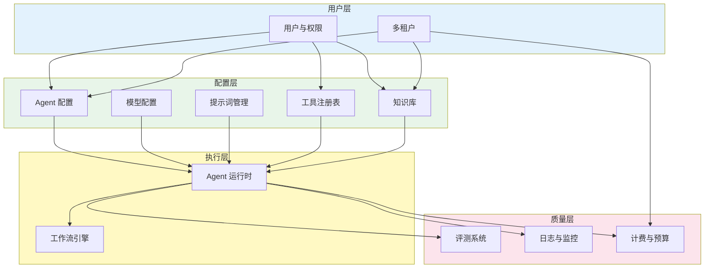
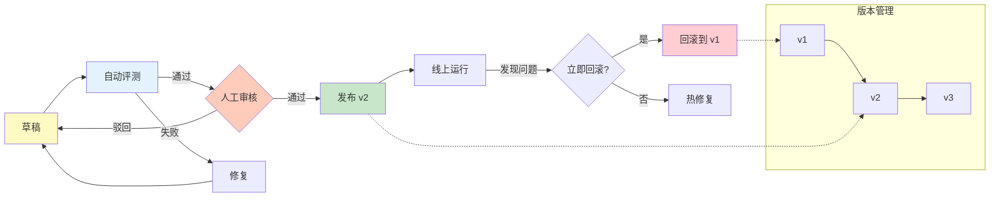

# 11 平台工程化

## 本章目标

前面章节讲的是如何做一个 Agent。平台工程化讲的是如何让很多人、很多业务、很多 Agent 稳定地运行。

本章会讲：

- Agent 平台需要哪些核心模块。
- 如何设计数据模型和 API。
- 如何管理工具、知识库、工作流和版本。
- 如何支持多租户、队列、部署和扩展。

## 从单个 Agent 到平台

一个脚本版 Agent 可能只有几个文件：

```txt
prompt + model call + tool functions
```

一个平台要处理更多问题：

- 多个用户创建 Agent。
- 多个 Agent 使用不同工具。
- 多个知识库独立管理。
- 运行记录需要追踪。
- 权限和计费需要隔离。
- 发布后不能随便破坏旧版本。
- 任务可能很长，需要异步执行。

平台不是把代码堆大，而是把边界设计清楚。



## 核心模块

一个通用 Agent 平台可以拆成这些模块。不是所有平台第一天都要做全，但设计时要知道这些模块会出现。

## 数据模型定义

平台的核心资源需要稳定的数据模型。

```prisma
model Tenant {
  id        String   @id @default(cuid())
  name      String
  agents    Agent[]
  createdAt DateTime @default(now())
}

model Agent {
  id          String   @id @default(cuid())
  tenantId    String
  name        String
  model       String   @default("gpt-4o-mini")
  systemPrompt String  @db.Text
  maxTurns    Int      @default(10)
  version     Int      @default(1)
  published   Boolean  @default(false)

  tenant Tenant  @relation(fields: [tenantId], references: [id])
  tools  AgentTool[]
  runs   Run[]
  createdAt DateTime @default(now())
}

model Tool {
  id          String   @id @default(cuid())
  name        String   @unique
  description String   @db.Text
  inputSchema Json
  riskLevel   String   @default("low")
}

model AgentTool {
  agentId String
  toolId  String
  agent   Agent @relation(fields: [agentId], references: [id])
  tool    Tool  @relation(fields: [toolId], references: [id])
  @@id([agentId, toolId])
}

model Run {
  id        String   @id @default(cuid())
  agentId   String
  agentVersion Int
  input     String   @db.Text
  output    String?  @db.Text
  status    String   // running | paused | completed | failed
  cost      Float    @default(0)
  createdAt DateTime @default(now())
}
```

注意区分"配置"和"运行记录"。Agent.Tool,KnowledgeBase 是配置,Run 是运行记录。
`agentVersion` 字段用于回放时知道当时用的是哪个版本的配置。

注意把“配置”和“运行记录”分开。配置描述 Agent 是什么，运行记录描述某次执行发生了什么。

## 工具注册表

工具不要散落在代码里。平台需要工具注册表：

```ts
type ToolDefinition = {
  id: string;
  name: string;
  description: string;
  inputSchema: unknown;
  riskLevel: 'low' | 'medium' | 'high';
  requiresConfirmation: boolean;
  executor: string;
};
```

工具注册表解决：

- Agent 可以选择哪些工具。
- 模型看到什么工具说明。
- 运行时如何执行工具。
- 权限系统如何判断风险。
- 前端如何展示工具配置。

## 知识库模型

知识库至少包含：

```ts
type KnowledgeBase = {
  id: string;
  name: string;
  ownerId: string;
  visibility: 'private' | 'team' | 'public';
};

type Document = {
  id: string;
  knowledgeBaseId: string;
  title: string;
  status: 'processing' | 'ready' | 'failed';
};

type Chunk = {
  id: string;
  documentId: string;
  text: string;
  embeddingId?: string;
  metadata: Record<string, unknown>;
};
```

文档上传和向量化通常是异步任务。不要让用户上传大文件后一直卡在请求里等待。

## 工作流版本

工作流会不断变化，但运行记录需要可回放。因此要做版本管理：

```ts
type WorkflowVersion = {
  workflowId: string;
  version: number;
  nodes: unknown[];
  edges: unknown[];
  publishedAt: number;
};
```

一次 Run 应该绑定当时使用的版本：

```ts
type RunRecord = {
  id: string;
  agentId: string;
  agentVersion: number;
  workflowVersion?: number;
};
```

否则你以后看到一个失败 Run，却不知道它当时跑的是哪版配置。

## API 设计

平台常见 API：

```txt
POST /agents
GET /agents/:id
PATCH /agents/:id
POST /agents/:id/publish

POST /runs
GET /runs/:id
GET /runs/:id/events
POST /runs/:id/cancel
POST /runs/:id/resume

POST /knowledge-bases
POST /knowledge-bases/:id/documents
GET /knowledge-bases/:id/search

GET /tools
POST /workflows
POST /evals/run
```

API 的关键不是数量，而是一致性：

- 创建配置和运行任务分开。
- 同步请求和异步任务分开。
- 读操作和写操作分开。
- 高风险操作需要确认令牌。

## 队列与异步任务

```ts
type JobStatus = 'pending' | 'running' | 'completed' | 'failed';

type Job = {
  id: string;
  type: 'document_parsing' | 'embedding' | 'eval_run' | 'agent_run';
  payload: unknown;
  status: JobStatus;
  attempts: number;
  maxAttempts: number;
  error?: string;
  createdAt: number;
  updatedAt: number;
};

class JobQueue {
  private queue: Job[] = [];
  private processing = new Set<string>();
  private concurrency: number;

  constructor(maxConcurrent = 5) {
    this.concurrency = maxConcurrent;
  }

  enqueue(job: Omit<Job, 'id' | 'status' | 'attempts' | 'createdAt' | 'updatedAt'>): string {
    const id = crypto.randomUUID();
    this.queue.push({
      ...job,
      id,
      status: 'pending',
      attempts: 0,
      createdAt: Date.now(),
      updatedAt: Date.now()
    });
    this.processQueue();
    return id;
  }

  private async processQueue(): Promise<void> {
    if (this.processing.size >= this.concurrency) return;

    const job = this.queue.find((j) => j.status === 'pending');
    if (!job) return;

    job.status = 'running';
    job.attempts++;
    this.processing.add(job.id);

    try {
      await this.executeJob(job);
      job.status = 'completed';
    } catch (error) {
      if (job.attempts < job.maxAttempts) {
        job.status = 'pending'; // 放回队列重试
      } else {
        job.status = 'failed';
        job.error = String(error);
      }
    } finally {
      this.processing.delete(job.id);
      job.updatedAt = Date.now();
      this.processQueue(); // 处理下一个
    }
  }

  private async executeJob(job: Job): Promise<void> {
    switch (job.type) {
      case 'document_parsing':
        // 调用文档解析服务
        break;
      case 'embedding':
        // 调用 embedding 服务
        break;
      case 'agent_run':
        // 异步执行 Agent
        break;
    }
  }

  getStatus(jobId: string): JobStatus | null {
    return this.queue.find((j) => j.id === jobId)?.status ?? null;
  }
}
```

这些任务适合放进队列：

- 文档解析。
- embedding 生成。
- 批量评测。
- 长时间 Agent Run。
- 外部工具回调等待。

队列任务要保存状态：

```ts
type Job = {
  id: string;
  type: string;
  status: 'pending' | 'running' | 'completed' | 'failed';
  payload: unknown;
  attempts: number;
  error?: string;
};
```

异步任务的用户体验也要设计好：让用户看到处理中、失败原因和重试入口。

## 多租户

如果平台服务多个团队或客户，需要多租户隔离。

每个核心资源都应带租户信息：

```ts
type TenantScoped = {
  tenantId: string;
};
```

查询时必须加租户过滤。不要依赖前端隐藏数据，也不要依赖模型判断权限。

## 发布与回滚

Agent 配置需要发布流程：



发布前至少检查：

- 提示词不为空。
- 工具权限合法。
- 知识库可访问。
- 预算配置合理。
- 关键评测通过。

回滚时恢复上一版配置，而不是手工改回去。

## 前端产品形态

Agent 平台常见界面：

- Agent 列表。
- Agent 配置页。
- 提示词编辑器。
- 工具选择器。
- 知识库管理。
- 工作流画布。
- 调试对话窗口。
- 运行记录详情。
- 评测结果面板。

调试界面尤其重要。开发者需要看到每一步输入、输出、工具参数、检索结果和错误。

## 本章练习

设计你的 Agent 平台蓝图：

1. 画出核心模块。
2. 定义 Agent、Tool、KnowledgeBase、Run 四个数据模型。
3. 设计创建 Run 和查询事件流的 API。
4. 设计工具注册表。
5. 设计 Agent 配置发布流程。
6. 设计一次失败 Run 的排查页面。

完成后，你就从“会写 Agent”进入了“会设计 Agent 平台”的阶段。
